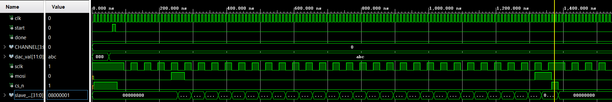
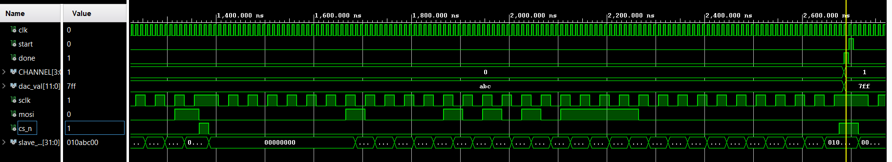
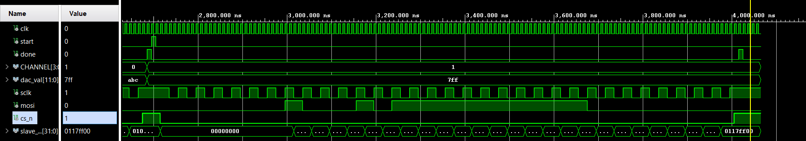
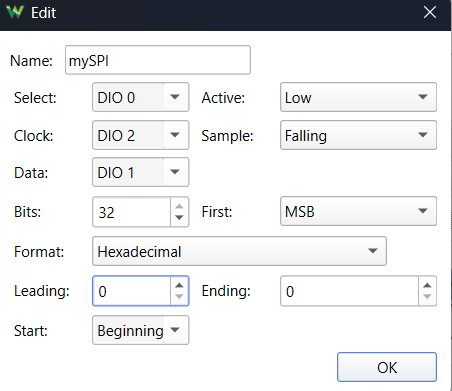
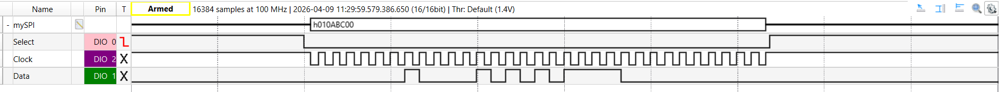
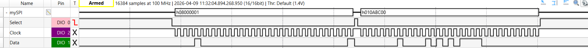
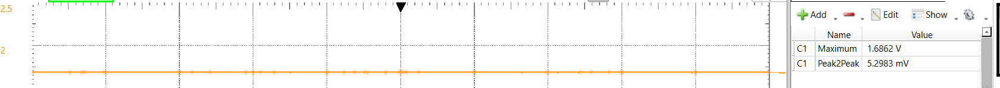

# PmodDA4 — AD5628 Driver with Universal SPI Master

A from-scratch VHDL driver for the **Digilent PmodDA4** (AD5628 octal 12-bit DAC), written on top of a custom universal SPI master module [SPI Master](..\vhd11_spi_all_modes\README.md). Unlike the previous project [PMODDA4 Driver (DAC AD5628)](..\d00_pmodda4_driver\README.md) which adapted Digilent's official controller, this implementation is built entirely from the ground up to work with the generic SPI IP.

**Target board:** Digilent Cmod A7 (Artix-7 XC7A35T)

---

## Architecture

```
top.vhd
 └── PmodDA4.vhd          ← AD5628 state machine (INIT_REF → TRANSFER)
      └── spi_all_modes.vhd  ← Universal SPI master (CPOL/CPHA generics)
```

`PmodDA4` manages the AD5628-specific sequencing: on the very first transaction it automatically sends an **internal reference enable** command, then sends the requested DAC write on all subsequent calls. The SPI framing is fully delegated to `spi_all_modes`.

---

## SPI Configuration

| Parameter | Value |
|-----------|-------|
| Mode | SPI Mode 2 (CPOL=1, CPHA=0) |
| SCLK idle | High |
| Sample edge | Falling |
| Frame width | 32 bits, MSB first |
| System clock | 12 MHz (Cmod A7 oscillator) |
| SCLK | 3 MHz |

---

## AD5628 32-bit Command Frame

```
 Bits [31:28]  [27:24]   [23:20]    [19:8]     [7:4]   [3:0]
 ─────────────────────────────────────────────────────────────
   0000        CMD       CHANNEL    DAC_VALUE  0000    0000
   (pad)                                       (don't care)
```

| CMD field | Value | Meaning |
|-----------|-------|---------|
| `0011`    | `3`   | Write AND Update DAC Channel n |
| `1000`    | `8`   | Set up internal reference register |

**Transaction sequence on first `start` pulse:**

1. **Frame 1** — `0x08000001` → Enable internal 2.5 V reference
2. **Frame 2** — `0x03XYYY00` → Write & Update channel X with value YYY

All subsequent `start` pulses send only Frame 2.

---

## Simulation

The testbench (`tb/tb_PmodDA4.vhd`) includes a SPI Mode 2 slave model that captures every MOSI bit on the falling SCLK edge. Two self-checking assertions verify the exact 32-bit frames.

### Test 1 — CH_A (0000), value = 0xABC → expected frame `0x030ABC00`

**Start of simulation:** INIT_REF frame clocking out (slave builds up `0x08000001`).



**Immediately after INIT_REF:** data frame for CH_A 0xABC begins.



### Test 2 — CH_B (0001), value = 0x7FF → expected frame `0x0317FF00`



Both assertions pass; simulation completes with `"SIM COMPLETE -- all tests passed"`.

---

## Hardware Verification

Tested on Cmod A7 with an **Analog Discovery 3** logic analyzer running WaveForms.

### Pinout (Pmod JA)

| Signal | FPGA pin |
|--------|----------|
| CS_N   | G17 (JA pin 1) |
| MOSI   | G19 (JA pin 2) |
| SCLK   | L18 (JA pin 4) |

### WaveForms SPI Decoder Setup



`CS=DIO0 (Active Low)`, `CLK=DIO2 (Falling sample)`, `Data=DIO1`, 32-bit MSB, Hexadecimal.

### Captured SPI Frames

Single-frame capture (data transaction):



Two-frame capture (init + data on first button press):



### Analog Output Measurement

CH_A programmed with `0xABC`, internal 2.5 V reference.  
Expected: `(0xABC / 4096) × 2.5 V = 2748 / 4096 × 2.5 ≈ 1.676 V`



Measured: **1.6862 V**, peak-to-peak noise: **5.3 mV**. Output stable and correct.

---

## Critical Bug (Fixed)

The AD5628 `CMD` field **must be `0011`** (Write AND Update DAC Channel n), not `0001` (Update from input register). Using `0001` silently does nothing on power-up because the input register is unprogrammed. This is a common trap when reading the datasheet command table.

---

## Key Timing Constraints (AD5628)

| Constraint | Spec | Notes |
|------------|------|-------|
| `t4` SYNC→SCLK setup | ≥ 13 ns | Cannot start SCLK on the same cycle CS_N goes low |
| `t8` SYNC high time | ≥ 15 ns | Must hold CS_N high between consecutive frames |
| DAC settling time | 7 µs max | Minimum interval between DAC updates for accurate output |

---

## File Structure

```
d01_pmodda4/
├── Notes.md             ← AD5628 datasheet study notes
├── src/
│   ├── PmodDA4.vhd          ← AD5628 controller state machine
│   ├── spi_all_modes.vhd    ← Universal SPI master (CPOL/CPHA generics)
│   ├── top.vhd              ← Cmod A7 top-level (BTN0 → start, LED → done)
│   └── Cmod-A7-Master.xdc  ← Pin constraints
├── tb/
│   ├── tb_PmodDA4.vhd       ← Self-checking testbench with slave model
│   └── tb_spi_all_modes.vhd ← SPI module testbench
└── doc/
    └── *.png                ← Simulation and hardware screenshots
```

---
⬅️  [MAIN PAGE](../README.md)  |  ⬅️  [PMODDA4 Driver (DAC AD5628)](..\d00_pmodda4_driver\README.md)