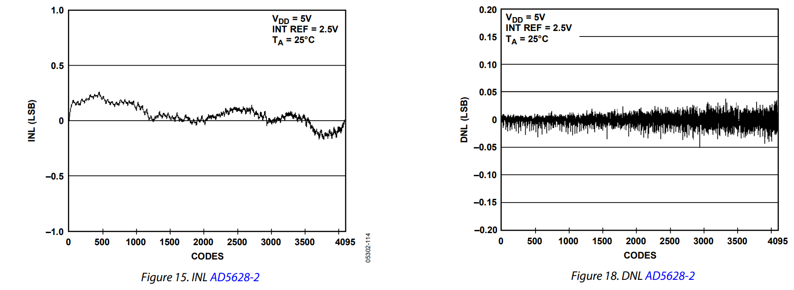

### Critical SPI Timing Constraints (The "Gotchas")

These are the constraints that a generic SPI IP block might violate if you aren't careful:

* **`t4` (SYNC to SCLK falling edge setup = 13 ns):** This is the most critical trap. When you pull `SYNC` low to start the frame, you **cannot** immediately drop the `SCLK` on that exact same clock cycle. `SYNC` must be held low for at least **13 ns** *before* the DAC sees the first falling edge of the clock. Your state machine must explicitly drop `SYNC`, wait a state (or half a state), and *then* start the clock toggling.
* **`t8` (Minimum SYNC high time = 15 ns):** When you finish sending your 32 bits and pull `SYNC` back high, the DAC needs time to process the command. You cannot instantly pull it back low to send a second command. Your VHDL must enforce an "Idle" state where `SYNC` sits high for at least **15 ns** (one full 20 ns clock cycle at 50 MHz is perfect) between frames.
* **`t12` (SCLK falling to LDAC rising = 15 ns):** *(Note: Safe to ignore if bypassing LDAC)* If you are physically wiring the `LDAC` pin to your FPGA and pulsing it in VHDL to update the output, you must wait at least **15 ns** after the 32nd clock edge before you pulse it.

### The Math in Action

The AD5628 has a built-in internal reference voltage of **2.5 Volts**. 

If the drift is 5 ppm, we can calculate how many volts that is:
$$2.5\ V \times \frac{5}{1,000,000} = 0.0000125\ V = 12.5\ \mu V\ (microvolts)$$

This means for **every 1°C change** in the room or on your circuit board, that 2.5V reference might drift up or down by a maximum of **12.5 µV**.

### Why does an FPGA developer care about this?

Let's say your FPGA board is sitting in a room, and over the course of the day, the temperature inside the enclosure goes up by **10°C**. 

Your reference voltage will drift by:
$$10^\circ C \times 12.5\ \mu V = 125\ \mu V$$

Now, remember from the title that the AD5628 is a **12-bit DAC**. That means it divides that 2.5V reference into 4096 distinct steps ($2^{12}$). 

The size of a single step (1 LSB - Least Significant Bit) is:
$$\frac{2.5\ V}{4096} \approx 610\ \mu V$$

**The Punchline:**
Because your temperature drift (**125 µV**) is much smaller than the size of a single digital step (**610 µV**), a 10°C temperature swing **won't even cause your DAC output to be wrong by a single bit**. 

For a 12-bit system, 5 ppm/°C is considered an exceptionally stable, high-quality reference. It means when you write a digital value from your VHDL driver to the DAC, you can trust the analog voltage coming out will be highly accurate, even if the board gets warm.

### 1. Guaranteed Monotonic by Design ("No Backwards Steps")
Think of the DAC's output like climbing a staircase. As you increase the digital number you send it, the analog voltage should always go up. 

In cheap DACs, the internal electronics aren't perfect, so taking a step "up" might actually cause the voltage to briefly dip *down* before going up. This is a non-monotonic glitch. "Guaranteed monotonic" means the manufacturer promises this chip will always step smoothly in the right direction. This prevents control systems (like robotic arms) from vibrating or glitching when you try to move them smoothly.

### 2. Power-On Reset to Zero / Midscale ("Safe Startup")
When you first power on your circuit board, your FPGA takes a moment to boot up before your VHDL code can start controlling things. During this dead time, the DAC needs to know what to do. 

Instead of outputting unpredictable, random voltages, this feature guarantees the DAC will wake up in a safe, known state—either perfectly at **0 Volts** (Zero Scale) or exactly in the middle of its voltage range (Midscale). This is a crucial safety feature so that things like motors or heaters don't randomly turn on full-blast while your FPGA is still waking up.

### 3. Rail-to-Rail Operation ("Using the Whole Box")
In electronics, the "rails" are the power supply voltages you use to turn the chip on. For example, you might power the AD5628 by connecting it to **5 Volts** (the top rail) and **0 Volts / Ground** (the bottom rail).

Older or cheaper chips have "dead zones" near their power limits. Even if you told a non-rail-to-rail DAC to output 0V or 5V, the physical circuitry might clip, only allowing it to reach down to 0.2V or up to 4.8V. 

"Rail-to-rail operation" means the DAC's internal amplifiers are specially designed to swing the output voltage all the way from the absolute bottom (0V) to the absolute top (5V). You get to use the entire voltage range you paid for without losing the extreme upper and lower edges.

### 4. Software Selectable Power-Down Loads ("Controlled Sleep Mode")

Because this chip has 8 individual DACs, you might not need to use all of them at the same time. To save power, you can send a VHDL command to put specific channels to sleep ("power-down mode").

But what happens to the physical output pin when you turn a DAC off? If it just disconnects completely, the pin "floats" (acts like an antenna). It can pick up electrical noise from your board, which might confuse or damage whatever circuit that DAC is plugged into.

"Software selectable output loads" means your VHDL code gets to dictate exactly how the DAC pin behaves while it is sleeping. You can tell it to internally connect a specific resistor (usually a 1 kΩ or 100 kΩ resistor) directly to ground. 

**Why you care as an FPGA developer:**
This gives you total, safe control over your hardware. If DAC Channel A is controlling a sensitive amplifier, you can tell it, "Go to sleep, and tie your output firmly to ground through a 1 kΩ resistor." This guarantees the line stays perfectly quiet at 0 Volts while turned off, preventing accidental glitches in the rest of your system.

### Variable Definitions
Before we dive into the formulas, here are the variables used across these measurements:
* **$D$**: The digital code you send (0 to 4095).
* **$V_{LSB}$**: The ideal voltage size of a single step.
* **$V_{ideal}(D)$**: The mathematically perfect voltage for code $D$ ($D \times V_{LSB}$).
* **$V_{out}(D)$**: The actual, physical voltage the chip outputs.

---

### 1. Relative Accuracy / Integral Nonlinearity (INL)
**Concept:** The maximum deviation of the actual output from the ideal straight-line transfer function.
**Math:** $$INL = \max \left| \frac{V_{out}(D) - V_{ideal}(D)}{V_{LSB}} \right|$$
**Intuition:** If you plot a perfect straight line from 0V to Maximum Volts, INL is the absolute furthest the physical output voltage ever bends or bows away from that perfect line. It is measured in LSBs.

### 2. Differential Nonlinearity (DNL)
**Concept:** The difference between a single actual analog step size and the ideal 1 LSB step size.
**Math:** Let $V_{step} = V_{out}(D) - V_{out}(D-1)$
$$DNL = \frac{V_{step} - V_{LSB}}{V_{LSB}}$$
**Intuition:** A perfect staircase has a DNL of 0. For this chip, DNL is ±0.25 LSB, meaning a physical step might be anywhere from 0.75 to 1.25 times the ideal size. Because DNL is always strictly greater than -1, the step size is mathematically guaranteed to be positive. The voltage cannot go backwards (Guaranteed Monotonic).

Figure 15 shows that under normal room-temperature conditions, the physical error is incredibly small—it barely even peaks at +0.25 LSB or drops to -0.20 LSB. This means your overall voltage accuracy across the entire 0V to 2.5V range is exceptionally tight.

Figure 18 graph is the visual proof of "Guaranteed Monotonicity." For a step to go backwards (non-monotonic), the DNL would have to drop below the -1.0 line. As you can see, the error across all 4096 steps is incredibly stable, hovering mostly within a microscopic ±0.05 LSB. Every single time your VHDL code increments by 1, the analog voltage will move upwards by a very consistent, predictable amount.

### 3. Zero-Code Error
**Concept:** The actual output voltage when the digital input is perfectly zero.
**Math:** $$E_{zero} = V_{out}(0) - 0\ V$$
**Intuition:** The residual "leakage" voltage (up to 19mV) present at the very bottom of the scale when the DAC is commanded to output exactly zero.

### 4. Full-Scale Error
**Concept:** The absolute error when the DAC is commanded to output its maximum voltage.
**Math:** $$E_{FS} = V_{out}(2^{N}-1) - V_{ideal}(2^{N}-1)$$
*(Where N is your resolution, so $2^{12}-1 = 4095$)*
**Intuition:** The total deviation from the perfect maximum voltage when you send all 1s (code 4095), usually expressed as a percentage of your total voltage range.

### 5. Gain Error
**Concept:** The deviation in the *slope* of the output curve, after ignoring the zero-code (offset) error.
**Math:** $$Gain\ Error = Actual\ Slope - Ideal\ Slope$$
**Intuition:** Think of Gain Error as a "multiplier" mistake. If your ideal staircase rises at a specific angle, Gain Error means the entire staircase was built slightly too steep or too shallow. It is a macro-error that gets worse the higher up the stairs you go (unlike Offset Error, which just shifts the whole staircase up or down by a constant amount).

### 1. Output Voltage Settling Time & Slew Rate (The Speed Limits)
**Concept:** How fast the DAC can change from one voltage to another and stabilize.
* **Slew Rate (1.2 V/µs):** This is the physical "top speed" of the output pin. If you tell the DAC to jump from 0V to 2.5V, the voltage will physically ramp up at a maximum speed of 1.2 Volts per microsecond. 
* **Settling Time (7 µs max):** When you slam the brakes at your target voltage, the signal might ring or bounce a tiny bit before perfectly stabilizing. This spec guarantees that within 7 microseconds of sending your VHDL command, the voltage will have finished ramping *and* stopped bouncing, settling to within 2 LSBs of perfect accuracy.
**Why you care for VHDL:** This defines your absolute maximum update rate. If you send a new SPI command to change the voltage every 1 microsecond, the physical hardware cannot keep up; it will just be a distorted mess. You must wait at least 7 µs between major voltage updates if you want precise, settled values.

### Output Amplifier

In this part, datasheet says..

>The slew rate is 1.5 V/µs with a ¼ to ¾ scale settling time of 7 µs. 

So we can create sine wave at full speed.

### Serial Interface

> Data from the DIN line is clocked into the 32-bit shift register on the falling edge of SCLK. 

> On the 32nd falling clock edge, the last data bit is clocked in and the programmed function is executed, that is, a change in DAC register contents and/or a change in the mode of operation. At this stage, the SYNC line can be kept low or be brought high. In either case, it must be brought high for a minimum of 15 ns before the next write sequence so that falling edge of SYNC can initiate the next write sequence.

0 0 0 1 Update DAC Register n

1 0 0 0 Set up internal REF register