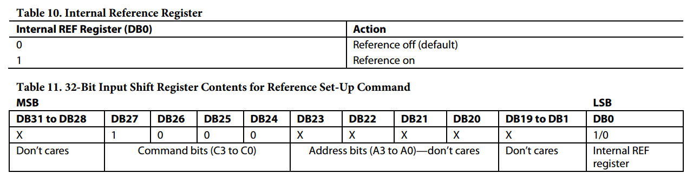
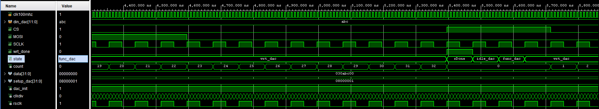
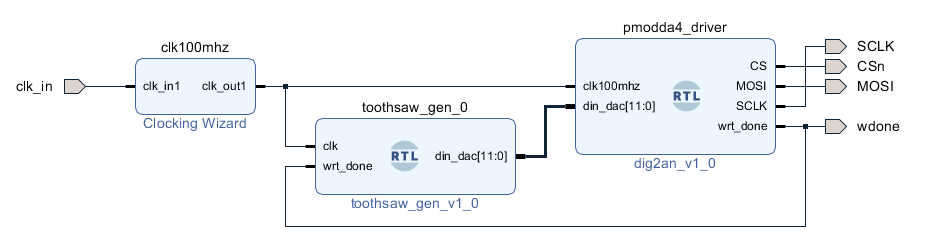

# PMODDA4 Driver (DAC AD5628)

This repository includes a revised VHDL driver for the Digilent **PmodDA4** (Analog Devices **AD5628**, 12-bit octal DAC), a simple testbench, and a small use-case study. The goal is to document not only *how* to talk to the DAC over SPI, but also *how fast* you can update it in a way that preserves waveform quality.

## TL;DR

* The AD5628’s SPI interface supports **up to 50 MHz SCLK**.
* Each write uses a **32-bit frame** (`[PAD4][CMD4][ADDR4][DATA12][PAD8]`), and the FSM in this VHDL driver adds **4 extra clocks**, so the **maximum theoretical update rate** is:

  $$
  f_\text{update,max}=\frac{f_\text{SCLK}}{32+4} = \frac{f_\text{SCLK}}{36}
  $$

  For example, **12.5 MHz SCLK → 347,222 S/s** per channel.
* The **true analog limit** is not the SPI bus but the **output amplifier’s settling time** and **slew rate**.

---

## Why “50 MHz SPI” ≠ “50 MHz output”

The SPI port can clock data very quickly, but the DAC’s output buffer must physically move the output voltage and *settle* to the new level. Two datasheet numbers matter:

### 1) Output Voltage Settling Time (¼→¾-scale, to ±2 LSB @ 16-bit criterion)

Typical **~2.5 µs**, worst-case **~7 µs** for a large step.

* This spec is defined for the **16-bit family member (AD5668)** with a very tight “±2 LSB @ 16-bit” window.
* On **AD5628 (12-bit)** the tolerance window is wider in volts, so *the same analog core* effectively settles *more easily* for 12-bit accuracy.
* Key idea: **large steps** need microseconds to settle; **small steps** (like adjacent sine samples when you oversample) settle much faster in practice.

### 2) Slew Rate

Typical **~1.2 V/µs**. This is the maximum slope the output can achieve.
For a sine wave, the peak slope is $\lvert dv/dt\rvert_\text{max} = 2\pi f\,V_\text{pk}$.
To avoid slew-induced distortion:

$$
2\pi f\,V_\text{pk} \le \text{SR}
\quad\Rightarrow\quad
f_\text{max} = \frac{\text{SR}}{2\pi V_\text{pk}}
$$

Examples with SR = 1.2 V/µs:

* **2.5 Vpp (1.25 Vpk)** → $f_\text{max} \approx 150\text{–}190\ \text{kHz}$
* **1.0 Vpp (0.5 Vpk)** → $f_\text{max} \approx 380\text{–}480\ \text{kHz}$

In short: SPI bandwidth decides **how often** you can send a code; **slew/settling** decides **how fast and how cleanly** the analog output can follow those codes.

## Practical operating point used here

For robust behavior and clean waveforms I use:

* **SCLK = 12.5 MHz** → **$f_s = 12.5\,\text{MHz}/36 = 347\,222\ \text{S/s}$**.

with $T_s \approx 2.88\,\mu s$ between updates.

## Implementation notes

I put the information from reference module to follow the VHDL code which is pretty self explanatory with the following info.

> The Pmod DA4 communicates with the host board via the SPI protocol. By driving the Chip Select (CS) line to a logic level low voltage, users may send a series of 32 bits of information with the data clocked into the appropriate register on the falling edge of the Serial Clock (SCLK). Once the 32nd bit of information has been clocked in, the command that was sent in the data stream is executed.

An example data stream of how the 32 bits are to be sent to the module is provided below 

Users should note that the Pmod DA4 by default attempts to use an external reference voltage. However, as there is no external reference voltage provided on the Pmod, users must write to the register to program the chip to use its internal reference voltage of 1.25V. The data stream required to change this (0x8001) is provided below:

These are the testbench results

## ZYBO Z7 Test

I also tested this on the **ZYBO Z7 FPGA board**. The design simply counts up from 0 to 4095 on every `wrt_done` pulse. The code is in the `src/` folder.

* Effective **fs = 347.2 kS/s**
* Ramp frequency ≈ **84.8 Hz**

Block design used in Vivado:

Scope capture of the sawtooth output:

I also routed `wrt_done` to a pin to verify the update frequency — it matches our theoretical assumption:

There is also a `top.vhd` in `src/` so you can run the same test without creating a block design. Testbench files are in the `tb/` folder.

---
⬅️  [MAIN PAGE](../README.md)
