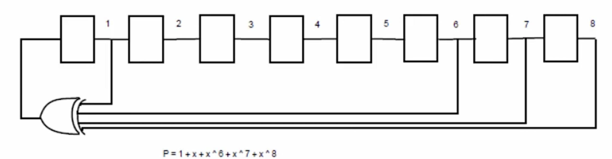
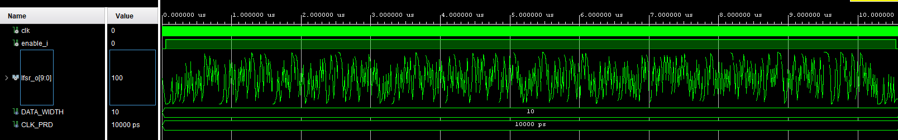

# Pseudo Random Number Generator using LFSR

If you need a random number generator or some random noise, an LFSR is a good structure to consider. When an LFSR is running, the pattern generated by its individual flip-flops is pseudo-random.

The maximum number of unique states a Linear Feedback Shift Register (LFSR) can generate is $2^n - 1$, where $n$ is the bit-width (excluding the all-zeros state). For an LFSR to achieve this maximum length—referred to as the **Maximum Length Sequence** or **m-sequence**—its feedback path must be governed by a characteristic polynomial with specific mathematical properties.

### Irreducible Polynomial

In mathematics, an irreducible polynomial is one that **cannot be factored** into a product of two lower-degree polynomials.

* If the chosen polynomial is not irreducible (i.e., it can be factored), the LFSR will enter a short cycle and repeat itself prematurely. For instance, instead of traversing 1023 states in a 10-bit register design, the sequence might loop back after only 30 to 40 states.

### Primitive Polynomial — *The Critical Criterion*

Every primitive polynomial is irreducible, but not every irreducible polynomial is primitive. For an LFSR to guarantee a full period of exactly $2^n - 1$ states, the polynomial must be **Primitive**.

* A primitive polynomial ensures that the state space of the flip-flops is not broken down into isolated sub-cycles, allowing the LFSR to traverse every possible valid combination in a single, massive loop.

---

## Selecting the Right Polynomial

In practice, instead of calculating these polynomials mathematically from scratch, engineers use pre-computed and verified **LFSR Polynomial Tables** (such as Xilinx application notes or Wikipedia listings) compiled by abstract algebra experts.

For example, a maximum-length primitive polynomial for $n = 10$ bits is:

$$P(x) = x^{10} + x^7 + 1$$

This expression means that to generate the feedback signal, the outputs of the **10th bit** and the **7th bit** must be fed into an XOR gate.

---

## Interface

**Generics**

| Name | Type | Default | Description |
|---|---|---|---|
| `DATA_WIDTH` | `integer` | `10` | Width of the LFSR register, in bits. |
| `POLY_MASK` | `std_logic_vector(9 downto 0)` | `"1001000000"` | Tap mask for the feedback polynomial. A `'1'` at index `i` means `data_r(i)` is XORed into the feedback. Must have a `'1'` at index `DATA_WIDTH - 1` (see Gotchas below). |

**Ports**

| Name | Direction | Type | Description |
|---|---|---|---|
| `clk` | in | `std_logic` | Clock. All activity is synchronous to its rising edge. |
| `enable_i` | in | `std_logic` | When `'1'`, advances the LFSR by one state per clock edge. |
| `lfsr_o` | out | `std_logic_vector(DATA_WIDTH - 1 downto 0)` | Current LFSR state. |

---

## Simulation

`tb_lfsr.vhd` instantiates `lfsr` with `DATA_WIDTH => 10` and the default `POLY_MASK`, driven by a 10 ns clock (`CLK_PRD`):

* `enable_i` goes high after 5 clock periods and stays high for 1050 cycles — enough to walk through nearly the entire 1023-state maximal-length sequence.
* `enable_i` then drops, and the simulation ends via `assert FALSE ... severity failure`.

`lfsr_o` toggles pseudo-randomly once `enable_i` goes high — the "noisy" appearance across the ~10 µs trace is the expected behavior of an LFSR walking through its maximal-length sequence rather than a clean, repeating pattern.

---

## Gotchas

* **Seed vs. `POLY_MASK` alignment:** `data_r`'s initial value (the seed) has a single `'1'` at the MSB. If `POLY_MASK` doesn't also have a `'1'` at that index, the feedback is always `'0'` and the LFSR locks up at all-zero permanently. There's no `rst` port to recover from this at runtime — the seed only applies once, at elaboration/power-up.
* **GHDL and generic-dependent aggregates:** the seed was originally written as `(DATA_WIDTH - 1 => '1', others => '0')`. GHDL rejects this with `non-locally static choice for an aggregate is allowed only if it is the only choice`, because `DATA_WIDTH - 1` depends on a generic and can't be mixed with `others`. Vivado tolerates this; GHDL doesn't. Fixed by using a concatenation instead, which has only one choice per aggregate: `'1' & (DATA_WIDTH - 2 downto 0 => '0')`.

---

## Detailed Code Explanation

### VHDL `variable` and the XOR Identity Element

* Inside the process, `xor_feedback_v` is declared as a `variable`. While VHDL signals (`signal`) do not update until the process concludes, variables update instantaneously. This immediate assignment is necessary to sequentially accumulate multiple XOR operations within a single clock cycle.
* The variable is reset to `'0'` at the start of every clock cycle, before the loop begins, because `A XOR 0 = A` (zero is the neutral element for XOR). Without this reset, the variable would carry its value over from the previous clock edge and corrupt the next feedback calculation, since process variables retain their value between activations.

### How `POLY_MASK` Bits Map to the Polynomial

* `data_r(i)` represents the polynomial term $x^{i+1}$. For the default `POLY_MASK = "1001000000"`, `data_r(9)` is the $x^{10}$ tap and `data_r(6)` is the $x^7$ tap. The `+1` constant term isn't a separate tap — it's just the wire that closes the loop, feeding `xor_feedback_v` back into `data_r(0)`.
* The loop computes `Σ (data_r(i) AND POLY_MASK(i)) mod 2` — a dot product over GF(2). A `'0'` in `POLY_MASK` forces that term to `'0'` (a no-op for XOR); a `'1'` passes `data_r(i)` straight through.
* Since `POLY_MASK` is a compile-time constant, synthesis unrolls the loop and optimizes away every AND gate fed by a constant `'0'`. What's left is just two AND gates and one XOR gate wired straight from `data_r(9)` and `data_r(6)` — there's no "loop" in the final netlist, just a static XOR tree shaped by wherever `POLY_MASK` has `'1'`s.
