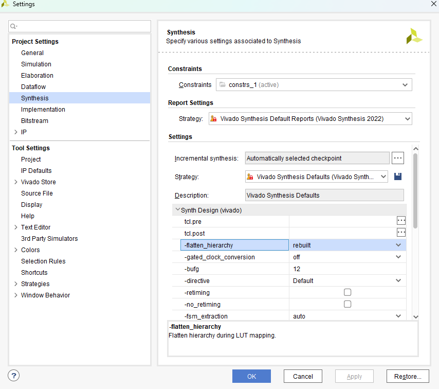
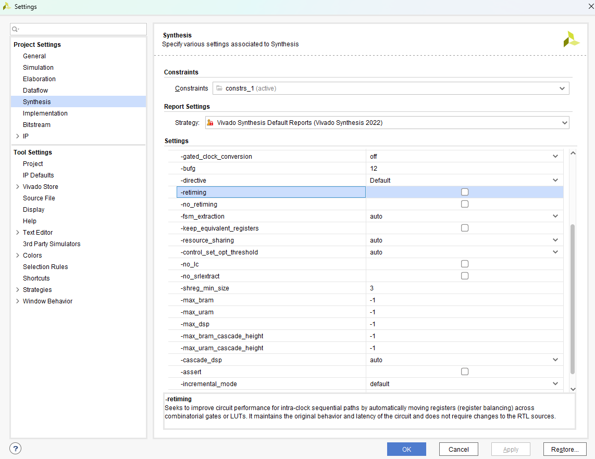

# VHDL Notes: Behaviors, Pitfalls, and Useful Tricks

A compact field guide to VHDL semantics and safe coding patterns.

## Process Semantics (the essentials)

* Inside **one process**, statements execute **sequentially** (top to bottom).
* **Different processes** run **concurrently**.
* **Signal** assignments update **after** the process suspends (end of delta cycle or clock edge). Multiple writes to the **same signal** inside one process resolve to the **last** one.
* VHDL is **case-insensitive**.

### Signals vs Variables (why your update “did nothing”)

* **Signals** (`<=`) read the *old* value until the process suspends.
* **Variables** (`:=`) update immediately and are visible to subsequent lines in the same process.

```vhdl
process(clk) is
  variable tmp : unsigned(7 downto 0);
begin
  if rising_edge(clk) then
    tmp := unsigned(b) + unsigned(c); -- immediate
    a   <= std_logic_vector(tmp);     -- scheduled for after edge
  end if;
end process;
```

* **Variables persist across activations.** A process variable is static storage — it is *not* re-initialized on every clock edge. If you accumulate into it (e.g. an XOR feedback chain in a loop) without explicitly resetting it first, it silently carries over its final value from the previous activation into the new one.

```vhdl
process(clk) is
  variable acc : std_logic;
begin
  if rising_edge(clk) then
    acc := '0'; -- must reset explicitly; without this, acc keeps last cycle's value
    for i in 0 to 9 loop
      acc := acc xor data(i);
    end loop;
    result <= acc;
  end if;
end process;
```

> **Worked example:** [dsp00 — LFSR](../dsp00_lfsr/README.md) hit this exact bug: the XOR feedback variable wasn't reset before the loop, so each cycle's feedback calculation silently included the previous cycle's leftover value instead of starting fresh.

### “Last assignment wins” (inside one process)

```vhdl
process(clk) begin
  if rising_edge(clk) then
    if sel = '0' then
      a <= b + c;
    else
      a <= b - c;
    end if;

    -- This line overrides the two above, still using OLD 'a' on RHS
    a <= a + b + c;

    if op = '1' then
      a <= x"03";  -- This is the final value assigned this cycle
    end if;
  end if;
end process;
```

> **Worked example:** [vhd03 — Button Debouncer](../vhd03_debouncer/README.md) covers two practical consequences of signal scheduling in a real multi-process FSM design: how to avoid a 1-cycle delay when two processes communicate through a signal (using a concurrent assignment instead of a registered one), and why signals that must be ready on entry to a new state have to be scheduled in the *current* state alongside the transition — not inside the next state.

## Edge Detection on Non-Clock Signals

To detect a rising (or falling) edge on an arbitrary signal, register its previous value and compare:

```vhdl
process(clk) is
begin
  if rising_edge(clk) then
    if sig = '1' and sig_prev = '0' then
      -- rising edge: single-cycle pulse
    end if;
    sig_prev <= sig;  -- update after the check
  end if;
end process;
```

`sig_prev` captures the value from the previous cycle. The condition fires only on the `'0'→'1'` transition, producing a clean one-cycle pulse regardless of how long `sig` stays high. For a **falling edge** flip the comparison (`sig = '0' and sig_prev = '1'`); for **any edge** use XOR (`sig xor sig_prev = '1'`).

> **Note:** `sig_prev` must be updated **after** the comparison (or equivalently at the end of the process — VHDL signal scheduling ensures the check still sees the old value). Placing the update before the `if` would mean both sides of the comparison see the same cycle's value and the edge is never detected.

> **Worked example:** [vhd04 — Button-Selectable Timer & LED Counter](../vhd04_tim_cnt/README.md) uses this pattern to advance a timing FSM on each button press without re-triggering while the button is held.

## Common Combinational Pitfalls

When writing a **combinational process**, watch out for:

1. **Sensitivity list**

   * All signals that are read must appear in the sensitivity list.

2. **Missing branches**
Always drive every output on every path.

   * Every `if` should have an `else`, every `case` should have a `when others`.
   * Otherwise: unintended **latch inference**.

3. **Read + write of same signal**

   * Writing and reading the same signal in a combinational process may cause **feedback loops**.

### Example 1: Unintended Latch

```vhdl
p3 : process (sel, b, c)
begin
  if (sel = '0') then
    a <= b + c;
  end if;
end process p3;
```

Here, if `sel = '1'`, signal `a` keeps its previous value. Because this is not sequential logic, the synthesizer infers a **latch**. Vivado synthesizes it but gives a warning.

```vhdl
p_COMB : process(all) is -- VHDL-2008
begin
  a <= (others => '0');         -- default
  if sel = '0' then
    a <= b + c;
  end if;                       -- no latch because default covers else
end process;
```

### Example 2: Combinational Feedback

```vhdl
PROCESS4 : process (sel, a, b, c)
begin
  if (sel = '0') then
    a <= a + b + c;
  else
    a <= a - b - c;
  end if;
end process PROCESS4;
```

Here, `a` is both read and written inside the same process. This creates a **combinational feedback loop**. Vivado synthesizes it without warnings, but it may cause oscillation or unstable behavior.

## Hierarchy Optimization in Vivado

Vivado has options like **rebuilt** and **none** for how it handles module hierarchy during synthesis:

* `rebuilt`: optimizer flattens and merges logic, removing unnecessary hierarchy. Your design may appear as one flat block.
* `none`: keeps submodules and hierarchy intact.



## Reset Strategy

* Xilinx recommends **synchronous, active-high reset**. This aligns with FPGA internal logic (active-high reset and clock-enable).
* Still, asynchronous reset is sometimes necessary.
* One trick is to use a generic like `rst_type : string := "ASYNC"` to switch between sync/async reset implementations.

### Example

```vhdl
library IEEE;
use IEEE.STD_LOGIC_1164.ALL;

entity top is
  generic (
    rst_type : string := "ASYNC"
  );
  port (
    clk : in std_logic;
    rst : in std_logic;
    a   : in std_logic;
    b   : in std_logic;
    c   : in std_logic;
    y   : out std_logic
  );
end top;

architecture Behavioral of top is
  -- Signal initialized to '1'. In SRAM-based FPGAs, FFs power up initialized.
  -- In ASICs or flash-based FPGAs, explicit reset is required.
  signal y_int : std_logic := '1';
begin

  -- Synchronous Reset
  G_SYNC : if rst_type = "SYNC" generate
    process (clk)
    begin
      if rising_edge(clk) then
        if (rst = '1') then
          y_int <= '1';
        else
          y_int <= (a and b and (not c)) or
                   ((not a) and b and c) or
                   ((not a) and (not b) and (not c));
        end if;
      end if;
    end process;
  end generate;

  -- Asynchronous Reset
  G_ASYNC : if rst_type = "ASYNC" generate
    process (clk, rst)
    begin
      if (rst = '1') then
        y_int <= '1';
      elsif rising_edge(clk) then
        y_int <= (a and b and (not c)) or
                 ((not a) and b and c) or
                 ((not a) and (not b) and (not c));
      end if;
    end process;
  end generate;

  y <= y_int;
end Behavioral;
```

## Timing Closure Trick

When struggling with timing violations:

* Add 2–3 input registers in front of the inputs of an entity; enable **retiming** in synthesis  (`Settings → Synthesis → Retiming`). Tools can legally move these through logic to balance paths, and may improve timing.
* Pipeline arithmetic (DSP48s love registered inputs and mids).
* Constrain clocks properly; avoid multicycle clocking unless you fully understand them.



## Clock-domain crossing (CDC) quick recipes

I will cover these in detail in future projects and link back here.

* **Single-bit control** from async/other domain → **2-FF synchronizer** (or 3-FF for extra MTBF).
* **Pulses** → convert to **toggle** in source domain; detect edge in destination domain.
* **Multi-bit data** → **dual-clock FIFO**, or Gray-coded counters with dual-port RAM.
* **Handshakes** → ready/valid or req/ack with proper synchronizers on each crossing bit.

## References

1. [VHDL ile FPGA PROGRAMLAMA](https://www.udemy.com/course/vhdl-ile-fpga-programlama-temel-seviye/)

---
⬅️ [MAIN PAGE](../README.md) | ⬅️ [VHDL Template](../gu00_vhdl_template/README.md) | ➡️  [Peripheral Driver Guide](../gu02_peripheral_guide/README.md)
