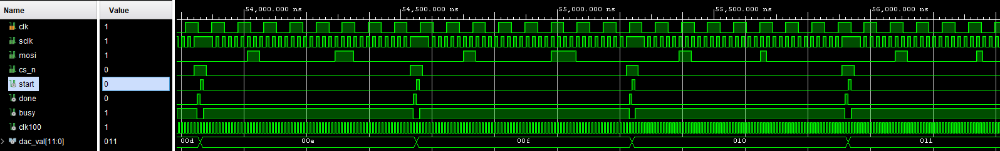
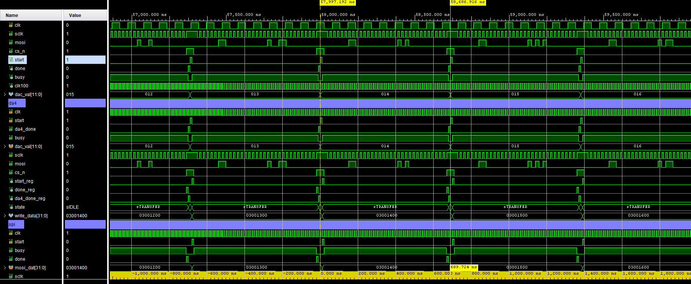
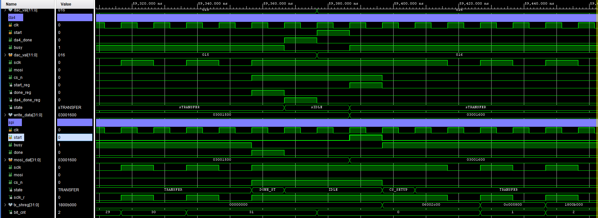
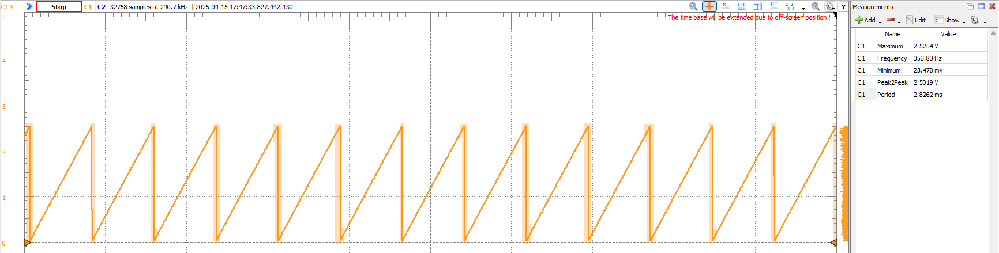

# p00 — Sawtooth Wave Generator via PmodDA4

Continuous sawtooth wave output on the **Digilent PmodDA4** (AD5628 octal 12-bit DAC), driven at **50 MHz SPI** from a 100 MHz system clock generated by the Vivado Clock Wizard IP.

Builds on the SPI and driver work done in [vhd12_cs_timing](../vhd12_cs_timing/README.md) and [d01_pmodda4](../d01_pmodda4/README.md). For the underlying methodology see the [Peripheral Driver Guide](../g00_peripheral_guide/README.md).

---

## Architecture

```
top_sawtooth.vhd
 ├── clk_wiz_0          ← Xilinx Clock Wizard IP: 12 MHz → 100 MHz
 ├── sawtooth_gen.vhd   ← 12-bit counter, fires one DAC write per free transaction
 └── PmodDA4.vhd        ← AD5628 FSM (INIT_REF on first write, then DAC writes)
      └── spi_cs_timing.vhd  ← Universal SPI Master, all 4 modes + CS timing
```

---

## Clock Wizard

The Cmod A7 provides a **12 MHz** on-board oscillator. The AD5628 supports SCLK up to 50 MHz, but running the SPI master at 50 MHz on a 12 MHz base clock is impractical (HALF_PER would be 0).

The Xilinx Clock Wizard IP (`clk_wiz_0`) generates a **100 MHz** system clock. All logic — sawtooth generator, PmodDA4 FSM, and SPI master — runs on this single clock domain, eliminating any CDC concerns.

| Clock | Frequency |
|-------|-----------|
| `clk` (on-board oscillator) | 12 MHz |
| `clk100` (Clock Wizard output) | 100 MHz |
| `sclk` (SPI) | 50 MHz |

---

## Sawtooth Generator

`sawtooth_gen` detects the **falling edge of `busy`** (PmodDA4 returning to idle) and immediately fires a new transaction:

```
busy:   ‾‾‾‾|_______|‾‾‾‾‾‾|_______
start:       _|‾|___        _|‾|___
val:    N         N+1            N+2
```

- On power-on `busy_prev` initialises to `'1'`, so the first write fires on the first clock cycle.
- The 12-bit counter wraps naturally (0 → 4095 → 0), producing the sawtooth ramp.
- No timer is needed — the generator is fully pipelined to the SPI master's availability.

### Output Frequency

Each DAC write takes one SPI transaction:

| Parameter | Value |
|-----------|-------|
| System clock | 100 MHz (10 ns/cycle) |
| SCLK | 50 MHz → HALF_PER = 1 cycle |
| Frame width | 32 bits |
| CS_SETUP_TICKS | 1 cycle |
| Cycles per transaction | ~69 cycles ≈ 690 ns |

Sawtooth frequency = 1 / (4096 steps × 690 ns) ≈ **354 Hz**

---

## SPI Configuration

| Parameter | Value |
|-----------|-------|
| Mode | SPI Mode 2 (CPOL=1, CPHA=0) |
| SCLK idle | High |
| Sample edge | Falling SCK |
| Frame width | 32 bits, MSB first |
| SCLK frequency | 50 MHz |
| CS_SETUP_TICKS | 1 (satisfies AD5628 t4 ≥ 13 ns) |
| CS_IDLE_TICKS | 0 |

---

## AD5628 Command Frame

```
 Bits [31:28]  [27:24]   [23:20]    [19:8]      [7:0]
 ──────────────────────────────────────────────────────
   0000        CMD       CHANNEL    DAC_VALUE   00000000
   (pad)
```

| CMD | Value | Meaning |
|-----|-------|---------|
| `1000` | `8` | Enable internal 2.5 V reference |
| `0011` | `3` | Write AND Update DAC channel n |

**Startup sequence (automatic, handled by PmodDA4.vhd):**

1. Frame 1 — `0x08000001` — Enable internal reference (sent once on first `start`)
2. Frame 2 — `0x030XYY00` — Write & Update channel X with 12-bit value YYY

---

## Simulation

### Integration simulation — full chain

The wide-view simulation shows the full hierarchy (sawtooth_gen → PmodDA4 → spi_cs_timing) running together. `dac_val[11:0]` increments each transaction (00d, 00e, 00f…), and `start` fires on every falling edge of `busy`.



### Transaction timing measurement

Cursors placed on consecutive `start` pulses confirm **689.724 ns** per transaction at 100 MHz — 69 clock cycles. `dac_val` advances one step per transaction (012 → 013 → 014…).



### Zoomed — FSM state transitions

Zoomed view showing the PmodDA4 FSM (`sTRANSFER → sIDLE → sTRANSFER`) and SPI layer states (`TRANSFER → DONE_ST → IDLE → CS_SETUP → TRANSFER`) back-to-back. `write_data[31:0]` shows consecutive frames (03001500, 03001600…).



---

## Hardware Verification

### Logic Analyzer (Analog Discovery 3)

The SPI bus was probed with the Analog Discovery 3 logic analyzer and the WaveForms SPI decoder configured as per the [Peripheral Driver Guide](../g00_peripheral_guide/README.md) (CS active-low, CLK falling sample, 32-bit MSB hex).

**Issue encountered — 50 MHz SCLK too fast for AD3 capture:** At the design's operating frequency of 50 MHz SCLK, the AD3 could not reliably decode the SPI frames. The sample rate was insufficient to resolve individual bits cleanly at that speed.

**Fix:** SCLK was temporarily reduced to **12.5 MHz** (HALF_PER = 3 in `spi_cs_timing`) for the logic analyzer capture. At 12.5 MHz the AD3 decoded all frames correctly, confirming the frame format, CS timing, and INIT_REF → data sequence were all correct. SCLK was then restored to 50 MHz for normal operation.

### Oscilloscope (Analog Discovery 3)

Once the SPI frames were confirmed correct via the logic analyzer, the analog output on CH_A was captured.



| Measurement | Value |
|-------------|-------|
| Frequency | 353.83 Hz |
| Period | 2.8262 ms |
| Maximum | 2.5254 V |
| Minimum | 23.478 mV |
| Peak2Peak | 2.5019 V |

The measured **353.83 Hz** matches the calculated **354 Hz** (1 / (4096 × 690 ns)). Peak-to-peak of 2.5019 V spans the full output range set by the internal 2.5 V reference.

---

## Testbench

`tb/tb_PmodDA4.vhd` — self-checking testbench for the PmodDA4 driver.

A SPI Mode 2 slave model captures every MOSI bit on the falling SCLK edge. Two assertions verify the exact 32-bit frames:

| Test | Channel | Value | Expected frame |
|------|---------|-------|----------------|
| 1 | CH_A (`0000`) | `0xABC` | `0x030ABC00` |
| 2 | CH_B (`0001`) | `0x7FF` | `0x0317FF00` |

Simulation ends with `"SIM COMPLETE -- all tests passed"` on success.

---

## Pinout (Pmod JA, Cmod A7)

| Signal | FPGA pin |
|--------|----------|
| CS_N   | G17 (JA pin 1) |
| MOSI   | G19 (JA pin 2) |
| SCLK   | L18 (JA pin 4) |

---

## File Structure

```
p00_sawtooth_dac/
├── src/
│   ├── top_sawtooth.vhd    ← Top-level: clk_wiz + sawtooth_gen + PmodDA4
│   ├── sawtooth_gen.vhd    ← Falling-edge busy detector, 12-bit counter
│   ├── PmodDA4.vhd         ← AD5628 FSM (INIT_REF + TRANSFER states)
│   ├── spi_cs_timing.vhd   ← Universal SPI master, all 4 modes + CS/idle timing
│   └── Cmod-A7-Master.xdc  ← Pin constraints
├── tb/
│   └── tb_PmodDA4.vhd      ← Self-checking testbench with Mode 2 slave model
└── doc/
    ├── sim_integration_toplevel.png  ← Integration sim, top-level wide view
    ├── sim_transaction_timing.png    ← Cursor measurement, 689.724 ns per transaction
    ├── sim_fsm_states.png            ← PmodDA4 + SPI FSM state transitions zoomed
    └── hw_scope_sawtooth.png         ← Oscilloscope sawtooth output, 353.83 Hz
```

---

## Key Concepts

- **Clock Wizard IP** — generating a higher-frequency clock from the on-board oscillator
- **50 MHz SPI** — maximum SPI rate achievable with a 100 MHz system clock (HALF_PER = 1)
- **Pipelined waveform generation** — zero idle cycles between transactions
- **AD5628 INIT_REF sequencing** — internal reference must be enabled before first DAC write

---

⬅️ [MAIN PAGE](../README.md) | ⬅️ [PmodDA4 Driver](../d01_pmodda4/README.md) | ⬅️ [SPI CS Timing](../vhd12_cs_timing/README.md) | [Peripheral Driver Guide](../g00_peripheral_guide/README.md)
