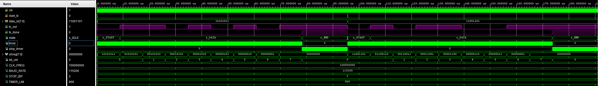

# UART Transmitter 

## References

1. [Mehmet Burak Aykenar - Github](https://github.com/mbaykenar/apis_anatolia)
2. [Universal Asynchronous Receiver Transmitter (UART)](https://vanhunteradams.com/Protocols/UART/UART.html)
