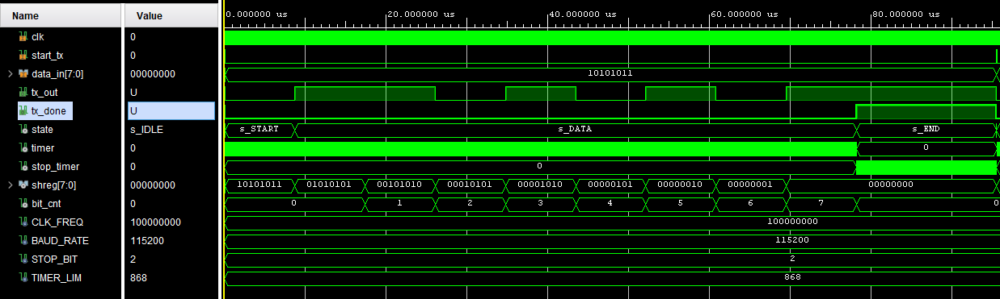

# UART Transmitter 

This is a simple UART transmitter project that is tested on CMOD A7 via HTERM. 

Basically, the communication packet is as follows, 

and we can deduce an FSM about how to transmit the data like

## References

1. [Mehmet Burak Aykenar - Github](https://github.com/mbaykenar/apis_anatolia)
2. [Universal Asynchronous Receiver Transmitter (UART)](https://vanhunteradams.com/Protocols/UART/UART.html)
