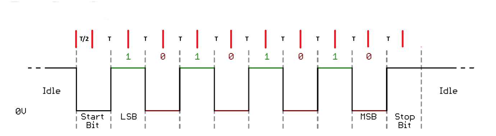
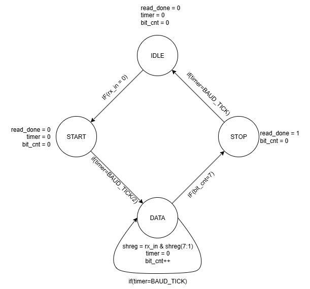
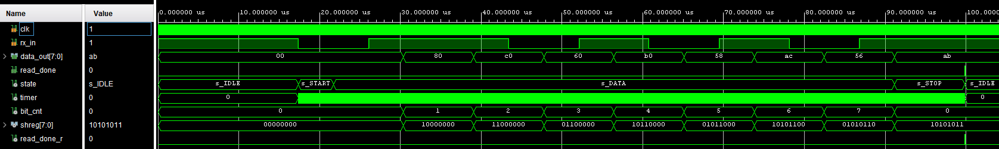

# UART Receiver (VHDL)

A compact, synthesizable **UART RX** for FPGA boards (verified on **CMOD A7**). It targets the classic **8-N-1/2** framing (8 data bits, no parity, one or two stop bits from the transmitter). Line idles high; data is LSB-first.

---

## Features

* Parametric clock and baud via `CLK_FREQ`, `BAUD_RATE`.
* **Mid-bit sampling** without oversampling: start bit is re-checked at **T/2**, data bits sampled every **T**.
* One-byte output with a **read strobe** `read_done` asserted for one bit period at the end of a valid frame.
* Clean 4-state FSM.

---

## Frame & Sampling

Idle `1` → **Start** `0` → **D0..D7** (LSB first) → **Stop** `1` (≥1 bit).

The **red vertical marks** on the timing figure are the exact sampling instants:

* first at **T/2** (to validate the start bit),
* then every **T** for the 8 data bits and the stop bit.

Sampling schedule:

$$
BAUD\_TICKS=\frac{CLK\_FREQ}{BAUD\_RATE},\qquad
sample\ times=T/2,\ T/2+T,\ T/2+2T,\ldots
$$

---

## State Machine

`IDLE → START → DATA → STOP → IDLE`

* **IDLE** – wait for falling edge (`rx_in='0'`).
* **START** – wait **T/2** and re-sample; if still `0`, it’s a valid start.
* **DATA** – sample every **T**, shift LSB-first into the byte; after 8 bits, go to STOP.
* **STOP** – sample once more after **T**; if high, assert `read_done='1'` for one bit time and return to IDLE.

Notes:

* Works with 1 **or more** stop bits from the peer.
* No parity; add a PARITY state if you need it.

---

## I/O

* `rx_in` — asynchronous serial input (idle high)
* `data_out[7:0]` — received byte (stable while `read_done='1'`)
* `read_done` — one-shot end-of-frame pulse

---

## Top-Level (CMOD A7 demo)

The demo assigns the **last two bits** of `data_out` to the two on-board LEDs and feeds the board’s **UART TXD** into `uart_txd_in` (the RX input). Adjust your XDC accordingly.

---

## Testbench

`tb_uart_rx.vhd` generates a correct UART waveform at 115 200 Bd on a 100 MHz clock, sends several bytes, and observes `read_done` and `data_out`. You should see sampling aligned to the red marks (mid-start, then per-bit).

---

## Files

* `uart_rx.vhd` — receiver RTL
* `top.vhd` — CMOD A7 demo wrapper
* `tb_uart_rx.vhd` — simulation testbench
* `docs/uart_timing.png` — frame with sampling instants (red lines)
* `docs/fsm_rx.png` — RX FSM
* `docs/tb.png` — expected waveform

---

## Integration tips

* Keep `CLK_FREQ/BAUD_RATE` close to an integer; standard UARTs tolerate a few percent mismatch.
* Back-to-back frames at full baud are supported; the core returns to `IDLE` immediately after `read_done` de-asserts.
* For noisy lines, extend to 3×/8×/16× oversampling and majority voting; this RX is the lean, single-sample version.

---

## References

1. [Mehmet Burak Aykenar – GitHub](https://github.com/mbaykenar/apis_anatolia)

---

⬅️  [MAIN PAGE](../README.md)
