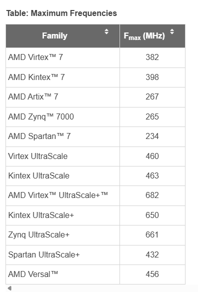
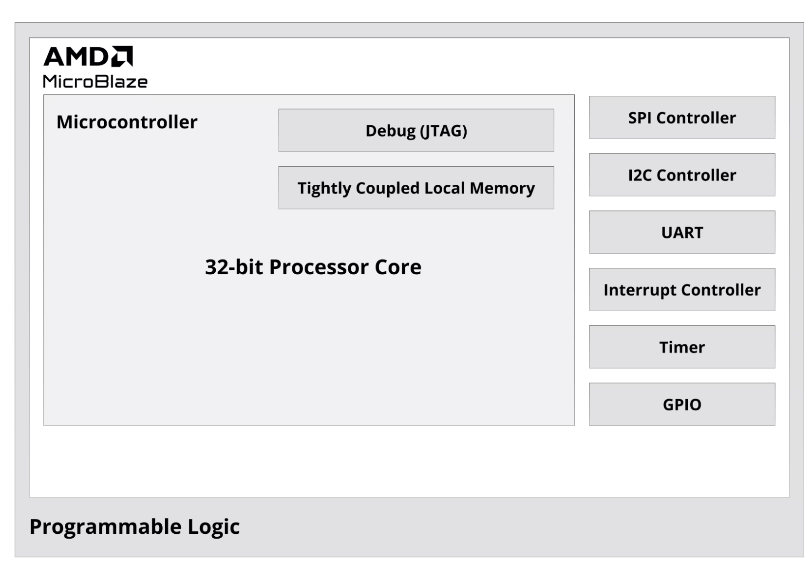
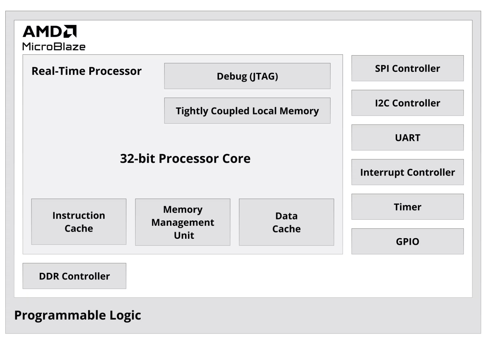
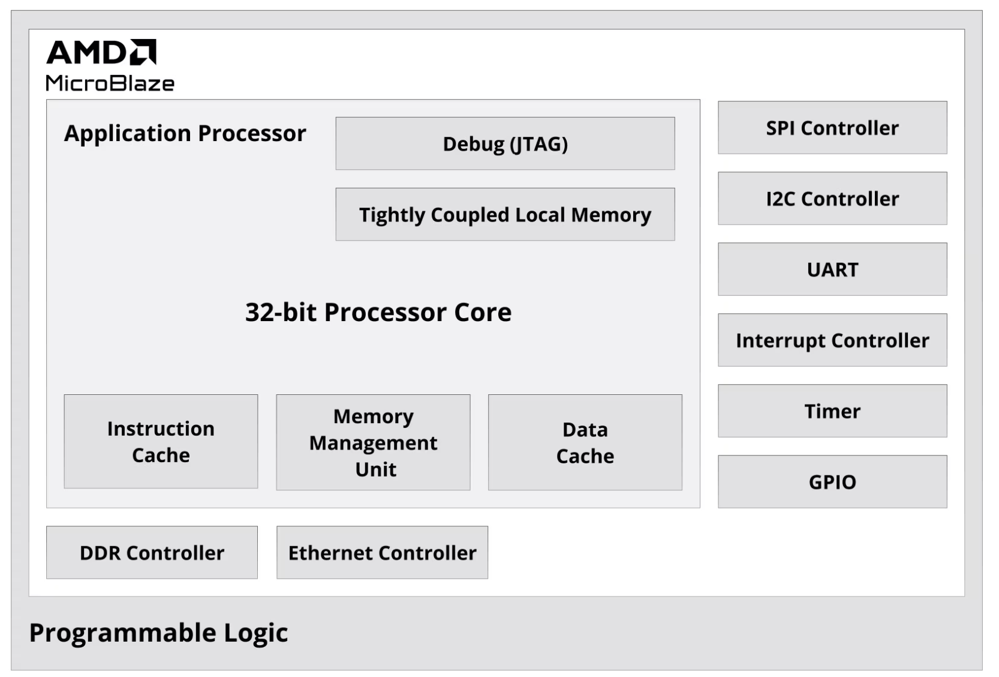

# MICROBLAZE GENERAL NOTES

## Maximum Frequencies

The maximum frequencies for the MicroBlaze core are provided in the following table. The fastest speed grade of each family is used to generate the results in this table.

## Preset Processor Options

## Application Examples

Multiple uB cores can be used in designs. Compare Outputs. Detect faults. 
Exp: Triple Modular Redundancy (TMR)
