# Microblaze GPIO

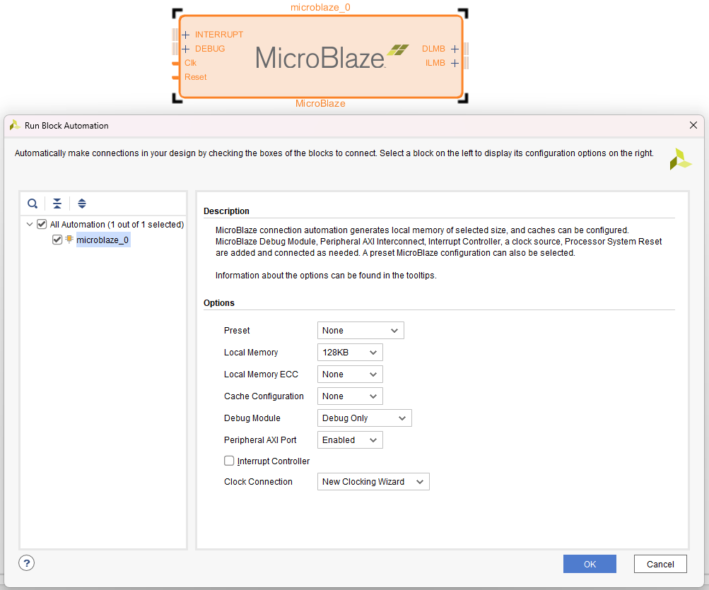

Double-click, Clocking Wizard Active High, Processor System Reset Active Low.
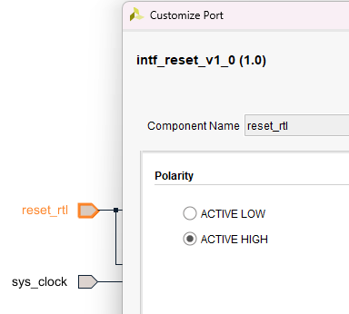

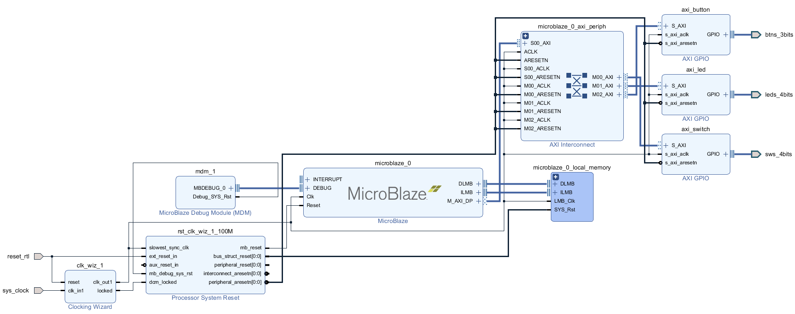

In order to get Tcl script 
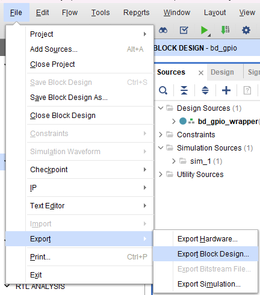

When synthesis is opened
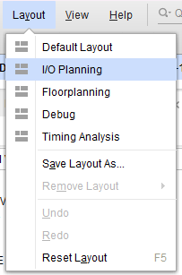

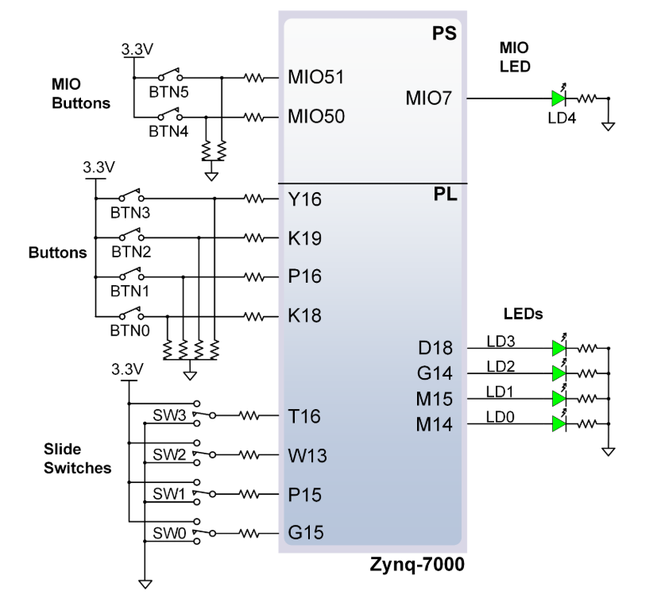

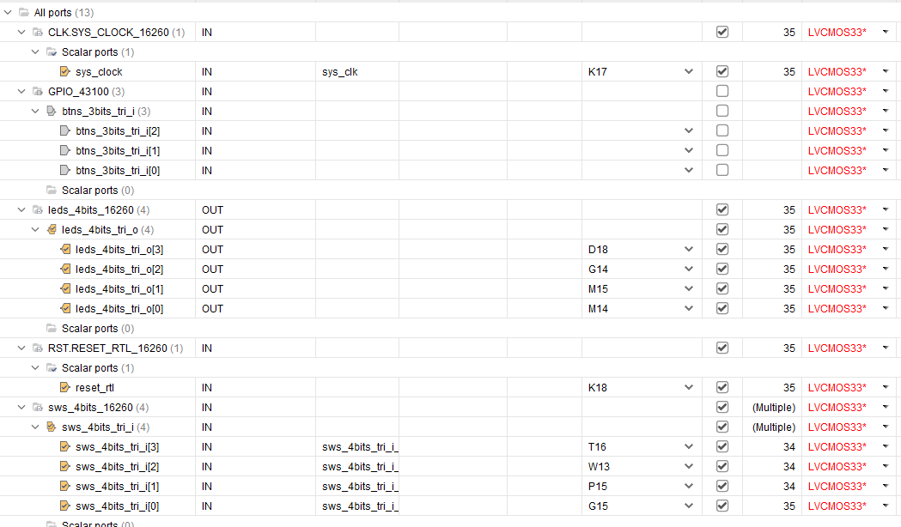

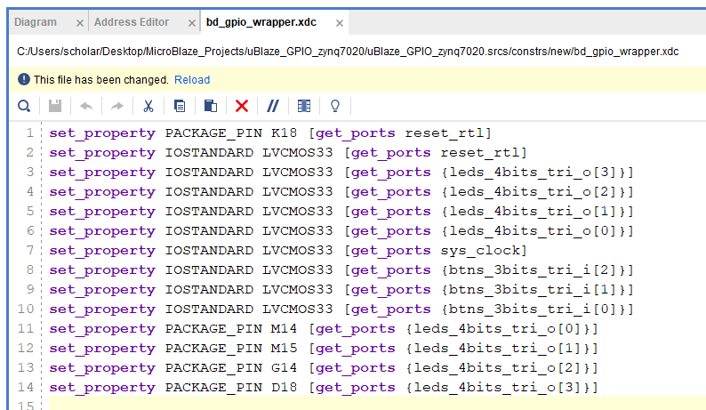

After this one, instead of Synthesis again, you can go to Design Runs, synth_1-> Force Up-to-date
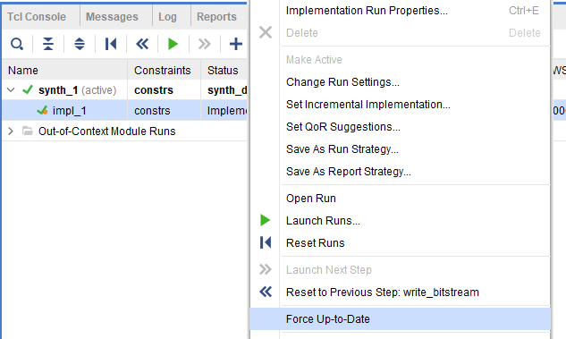

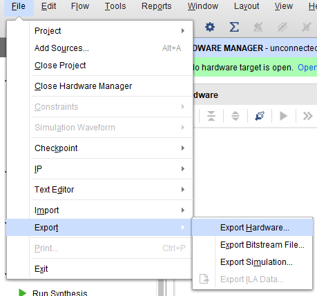

After creating our platform project with the xsa file that we exported from Vivado. Ctrl+B to build platform project and get rid of (out-of-date) status
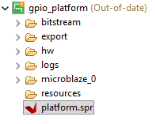

Create application project
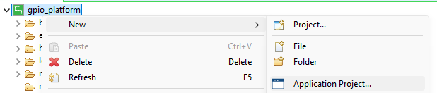