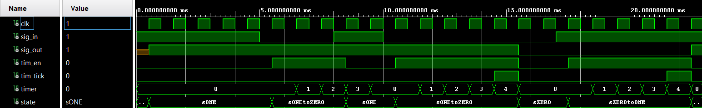

# DEBOUNCER (FSM)

When the input toggles, the system enters a transition state and waits a fixed time (debounce window). If the input stays stable until the timer expires, it commits to the new stable state; if it bounces back, it returns to the current stable state.

## FSM Design

Assuming the buttons are active-low:

States:

* `sONE` and `sZERO` — **stable** states (idle and pressed, respectively)
* `sONEtoZERO` and `sZEROtoONE` — **transition** states (debounce window running)
* `sINIT` — initializes FSM according to `ACTIVE_LOW` generic

### Transition logic (the core idea)

* From `sONE`, if input reads "pressed," go to `sONEtoZERO`, **enable the timer**, and wait.

  * If input flips back before timeout → bounce → return to `sONE`.
  * If timer expires while still pressed → accept → go to `sZERO`.
* Symmetric behavior for `sZERO → sZEROtoONE → sONE`.

The timeout counter is sized as:

```
TIM_LIM = (CLK_FREQ / 1000) * DEBTIME_MS
```

Example: 12 MHz, 5 ms → `TIM_LIM = 60_000`.

## Generics

```vhdl
generic (
  CLK_FREQ   : integer := 12_000_000; -- Hz
  DEBTIME_MS : integer := 5;          -- ms
  ACTIVE_LOW : boolean := false       -- false for CMOD A7 buttons
);
```

* Since I use CMOD A7's buttons, keep `ACTIVE_LOW = false`.

## Two-Process Structure & Signal Synchronization

The design is split into two clocked processes: `pMAIN` (FSM) and `pTIMER` (counter). This is a deliberate architectural choice — each process has a single responsibility.

However, this introduces an important VHDL subtlety: **when one process writes a signal, the other process does not see the new value until the next clock cycle.** This is because signal assignments are scheduled — they take effect only after all processes finish their current delta cycle.

In this design, `pTIMER` writes `tim_tick` and `pMAIN` reads it. If `tim_tick` were a registered signal (driven inside `pTIMER`'s clocked block), `pMAIN` would always see it one cycle late — meaning the FSM transition would fire one cycle after the timer actually expired.

To avoid this, `tim_tick` is implemented as a **concurrent signal assignment** outside both processes:

```vhdl
tim_tick <= '1' when (timer = TIM_LIM-1 and tim_en = '1') else '0';
```

This makes `tim_tick` combinational — it is asserted in the **same cycle** the timer hits its limit, so `pMAIN` can react immediately on the next rising edge.

> **Rule of thumb:** If two sequential processes communicate through a signal, expect a 1-cycle pipeline delay. When same-cycle reaction is needed, use a concurrent assignment instead.

## Pre-assigning Signals Before a State Transition

Another non-obvious consequence of the 1-cycle delay is the pattern of setting signals **in the current state** rather than at the entry of the next state.

In this design, `tim_en` is enabled in `sONE` at the same time as the state transition — not inside `sONEtoZERO` on entry:

```vhdl
when sONE =>
    if (sig_in = '0') then
        state  <= sONEtoZERO;
        tim_en <= '1';       -- set HERE, not inside sONEtoZERO
    end if;
```

This feels backwards at first — why set a signal that belongs to the next state while still in the current one? Because of scheduling:

```
-- Wrong: set tim_en inside sONEtoZERO on entry
Cycle 1: state transitions to sONEtoZERO, tim_en <= '1' scheduled
Cycle 2: sONEtoZERO active, tim_en becomes '1' → timer starts one cycle late

-- Correct: set tim_en in sONE alongside the transition
Cycle 1: state <= sONEtoZERO scheduled, tim_en <= '1' scheduled
Cycle 2: both take effect simultaneously → FSM is in sONEtoZERO AND tim_en is '1'
```

> **Rule of thumb:** Any signal that must be ready when you *arrive* at a new state must be scheduled in the cycle you *decide* to transition — i.e. in the current state, not the next one.

## Simulation

The waveform below shows:

* Start in `sONE` (idle), first press causes a jump to `sONEtoZERO`, timer runs.
* If the raw input bounces back before timeout, we cancel and return to `sONE`.
* When the input stays stable longer than `DEBTIME_MS`, we commit to `sZERO`.
* Symmetric behavior on release.



Tip: Put `state`, `tim_en`, `tim_tick`, `timer`, `sig_in`, and `sig_out` on your wave — those tell the whole story at a glance.

## References

1. [Mehmet Burak Aykenar - Github Repo](https://github.com/mbaykenar)

---
⬅️  [MAIN PAGE](../README.md)