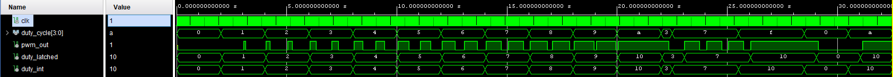
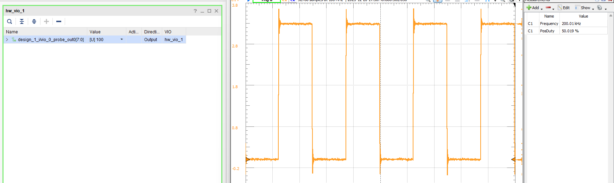

# Tick-Based PWM Output Module

A **clock-synchronous PWM generator** with a fixed PWM frequency and a programmable duty cycle. Fully generic with respect to system clock frequency, PWM frequency, and duty resolution.

---

## Source Files

| File | Description |
|------|-------------|
| `src/pwm_tick_based.vhd` | Core PWM generator — parametric frequency and duty resolution |
| `src/tb_pwm_tick.vhd` | Testbench |

---

## Core Mechanism

A free-running `timer` counts from `0` to `PWM_PERIOD − 1`. The output is compared against a latched duty value each clock cycle:

```
pwm_out = '1'  while  timer < duty_latched
pwm_out = '0'  otherwise
```

This naturally handles the 0% and 100% edge cases:

- `duty_latched = 0`          → output always LOW
- `duty_latched = PWM_PERIOD` → output always HIGH

## Generics

```vhdl
generic(
    CLK_FREQ : integer := 40_000_000; -- Hz
    PWM_FREQ : integer := 200_000;    -- Hz
    N        : integer := 8           -- duty cycle input width in bits
);
```

`PWM_PERIOD` is derived internally:

```
PWM_PERIOD = CLK_FREQ / PWM_FREQ
```

For 40 MHz and 200 kHz: `PWM_PERIOD = 200` — meaning 200 discrete duty steps.

## Choosing N Correctly

`N` controls the width of the `duty_cycle` input. It must be large enough to represent `PWM_PERIOD`:

```
N ≥ ceil(log2(PWM_PERIOD + 1))
```

If `N` is too small, the input can never reach `PWM_PERIOD` and 100% duty cycle becomes unreachable. Values above `PWM_PERIOD` are clamped safely regardless.

| CLK_FREQ | PWM_FREQ | PWM_PERIOD | Minimum N |
|----------|----------|------------|-----------|
| 12 MHz   | 200 kHz  | 60         | 6 bits    |
| 40 MHz   | 200 kHz  | 200        | 8 bits    |
| 100 MHz  | 200 kHz  | 500        | 9 bits    |

## Duty Cycle Handling — Three Stages

The duty cycle goes through three stages from input to output:

**1. Clamp (`duty_int`) — combinational**

```vhdl
duty_int <= PWM_PERIOD when (to_integer(unsigned(duty_cycle)) > PWM_PERIOD)
                       else to_integer(unsigned(duty_cycle));
```

`duty_int` updates immediately whenever `duty_cycle` changes. Values above `PWM_PERIOD` are saturated to `PWM_PERIOD`.

**2. Latch (`duty_latched`) — registered at period boundary**

```vhdl
if timer = 0 then
    duty_latched <= duty_int;
end if;
```

`duty_latched` only captures `duty_int` at the start of each PWM period (`timer = 0`). This ensures that a duty change mid-period does not cause an irregular pulse — the new value always takes effect on the next clean period boundary.

**3. Compare (`pwm_out`) — registered**

```vhdl
if timer < duty_latched then
    pwm_out <= '1';
else
    pwm_out <= '0';
end if;
```

Since both `duty_latched` and `pwm_out` are updated in the same registered process, there is no timing mismatch between them.

## Simulation Result



## Hardware Validation

I connected a VIO to drive `duty_cycle` and verified the output with an **Analog Discovery 3**. The waveform below shows the PWM output at a set duty cycle — frequency and high time matched the expected values.



---

## Used In

- [RGB LED Controller](../prj00_rgb_controller/README.md) — three instances driving R, G, B channels on the CMOD A7 onboard RGB LED.

---
⬅️ [MAIN PAGE](../README.md) | ⬅️ [Button-Selectable Timer & LED Counter](../vhd04_tim_cnt/README.md) | ➡️ [PWM Percentage Output](../vhd06_pwm_percent/README.md)