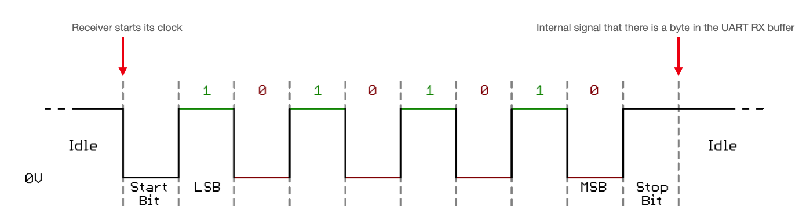
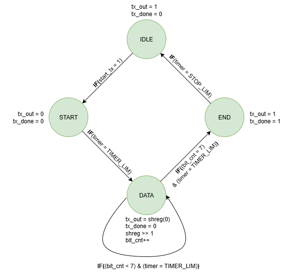
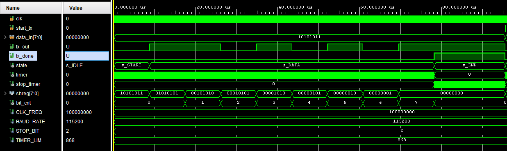

# UART Transmitter (VHDL)

A minimal, synthesizable UART **TX** for FPGA boards (tested on **CMOD A7**) and a clean testbench. The design is **8-N-1 or 8-N-2** selectable via generic (8 data bits, no parity, 1 or 2 stop bits), LSB-first, idle level high.

Note: unlike the [Debouncer](../p04_debouncer/README.md) which separates the FSM and timer into two processes, this design combines both into a single clocked process — the timer drives state transitions directly.

---

## Source Files

| File                      | Description                                             |
|---------------------------|---------------------------------------------------------|
| `src/uart_tx.vhd`         | Core UART TX FSM — parametric, 4-state                  |
| `src/tb_uart_tx.vhd`      | Testbench — sends 0xAB then 0xCD, self-terminating      |
| `src/top_uart_tx.vhd`     | Top level — sends incrementing byte once per second     |
| `src/top_uart_tx_btn.vhd` | Top level — sends 3 sequential bytes on button press    |

---

## Features

* **Parametric** clock, baud rate, and stop bit count via `CLK_FREQ`, `BAUD_RATE`, `STOP_BIT` generics
* **One-byte shifter** (no FIFO) — `start_tx` is sampled only in `s_IDLE`, pulses during busy states are ignored
* **Status output** `tx_done` asserted at the entry of `s_END`, held high for the stop bit period(s)
* Compact 4-state FSM: `s_IDLE → s_START → s_DATA → s_END → s_IDLE`

---

## UART Frame

Idle line is `'1'`. A frame is:

* **Start bit**: `'0'` for one bit period
* **8 data bits**: LSB first
* **STOP_BIT** stop bits: `'1'`

---

## Architecture

### State Machine

* `s_IDLE`: line high, waits for `start_tx = '1'`, latches `data_in` into shift register
* `s_START`: drives `'0'` for one bit period
* `s_DATA`: outputs 8 bits LSB-first, shifts right each bit period, `bit_cnt` tracks position
* `s_END`: outputs `'1'` for `STOP_BIT` bit periods, asserts `tx_done`

### Bit Timing

A simple integer timer generates bit periods:

$$
TIMER\_LIM=\frac{CLK\_FREQ}{BAUD\_RATE},\qquad
STOP\_LIM= TIMER\_LIM \times STOP\_BIT
$$

No oversampling — the TX side only needs period accuracy.

Key internal signals:

| Signal       | Description                       |
|--------------|-----------------------------------|
| `timer`      | counts `0 .. TIMER_LIM-1`         |
| `stop_timer` | counts stop-bit clocks            |
| `shreg`      | 8-bit shift register (data)       |
| `bit_cnt`    | bit position counter, `0 .. 7`    |

---

## Top Level 1 — Auto Transmit (`top_uart_tx.vhd`)

Sends an incrementing byte once per second (`CLK_FREQ = 12 MHz`). No button needed — useful for verifying the UART link is alive. `cnt` increments every second and wraps naturally at 255 back to 0. The onboard LED reflects `tx_done`.

Generics used:

* `CLK_FREQ  => 12_000_000`
* `BAUD_RATE => 115_200`
* `STOP_BIT  => 1`

Pinout (adapt to your XDC):

* `sysclk` → 12 MHz onboard clock
* `uart_rxd_out` → FTDI RX pin
* `led` → user LED

---

## Top Level 2 — Button Triggered (`top_uart_tx_btn.vhd`)

Sends 3 sequential bytes (`0x01, 0x02, 0x03`) on each button press, then returns to idle. Uses a 3-state FSM (`IDLE → DATA → sWAIT`) with edge detection on the button and falling-edge detection on `tx_done` to sequence the transfers.

Key design points:

* `cnt` resets to 0 in `IDLE` — each button press always sends the same sequence
* `datain <= std_logic_vector(cnt + 1)` uses an expression (not a signal read) to correctly capture the incremented value in the same cycle `start_tx` fires — see [pre-assignment note in Debouncer](../p04_debouncer/README.md#pre-assigning-signals-before-a-state-transition)
* `tx_done` falling edge detection (`tx_done_prev = '1' and tx_done_r = '0'`) triggers the next byte — fires after the stop bit period completes and `uart_tx` has returned to `s_IDLE`

Additional pinout vs Top Level 1:

* `btn` → onboard button (active high, no debounce needed at this baud rate)

---

## Testbench (`tb_uart_tx.vhd`)

Self-contained testbench with a 100 MHz clock:

* Sends `0xAB` (10101011) — alternating bits, good for scope verification
* Waits for full stop period, then sends `0xCD` (11001101) — verifies back-to-back transfers
* Uses `STOP_BIT = 2` to make the stop interval clearly visible in waveforms
* Ends with `assert false report "SIM DONE" severity failure`

Expected waveform:

---

## Integration Tips

* **Back-to-back bytes**: pulse `start_tx` again any time after `tx_done` goes low (after `s_END → s_IDLE` transition)
* **Glitch-free start**: `start_tx` is only sampled in `s_IDLE` — pulses during busy states are safely ignored
* **Reset**: design relies on power-up defaults — add an explicit synchronous reset if your toolflow requires it
* **Parity**: not implemented — easiest extension is to insert a `PARITY` state between `s_DATA` and `s_END`

---

## References

1. [Mehmet Burak Aykenar - Github](https://github.com/mbaykenar/apis_anatolia)

---
⬅️  [MAIN PAGE](../README.md)