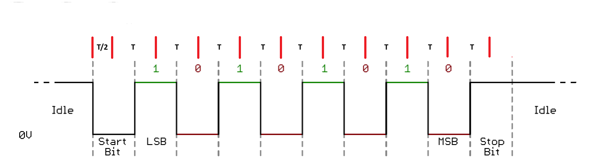
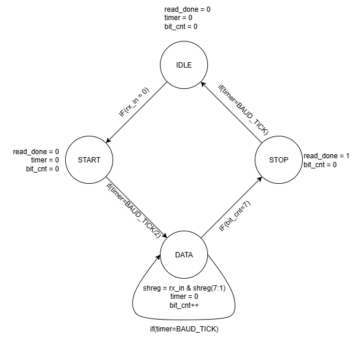
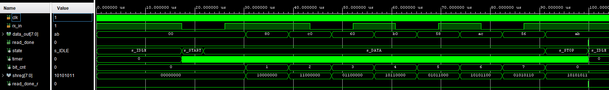

# UART Receiver (VHDL)

A compact, synthesizable **UART RX** for FPGA boards. Targets classic **8-N-1/2** framing (8 data bits, no parity, one or two stop bits). Line idles high, data is LSB-first.

---

## Source Files

| File | Description |
|------|-------------|
| `src/uart_rx.vhd` | Core UART RX FSM — mid-bit sampling, 4-state |
| `src/top_uart_rx.vhd` | Top level 1 — 3-byte sequence detector driving LEDs |
| `src/echo_uart_rx.vhd` | Top level 2 — 3-byte unlock sequence then echo back over TX |
| `src/tb_uart_rx.vhd` | Testbench — generates UART waveform, observes output |

`uart_tx.vhd` file is in the [UART Transmitter](../vhd07_uart_tx/README.md) project folder.

---
## Features

* **Mid-bit sampling** without oversampling — start bit re-checked at **T/2**, data bits sampled every **T**
* One-byte output with `read_done` strobe asserted for one clock period at end of valid frame
* Back-to-back frames supported — core returns to `IDLE` immediately after `read_done` de-asserts

---

## Frame & Sampling

Idle `'1'` → **Start** `'0'` → **D0..D7** LSB-first → **Stop** `'1'`

The sampling schedule:

$$
BAUD\_TICKS=\frac{CLK\_FREQ}{BAUD\_RATE},\qquad
t_{sample}=T/2,\ T/2+T,\ T/2+2T,\ldots
$$

First sample at **T/2** validates the start bit. Each subsequent sample at **T** intervals captures one data bit at the centre of its eye.



---

## State Machine



`s_IDLE → s_START → s_DATA → s_STOP → s_IDLE`

* **s_IDLE** — waits for falling edge on `rx_in`
* **s_START** — waits T/2 and re-samples; if still `'0'` it is a valid start bit, not a glitch
* **s_DATA** — samples every T, shifts LSB-first into the byte register; after 8 bits transitions to s_STOP
* **s_STOP** — samples after T; if high, asserts `read_done = '1'` for one clock period and returns to s_IDLE

---

## Ports

| Port | Direction | Description |
|------|-----------|-------------|
| `clk` | in | System clock |
| `rx_in` | in | Asynchronous serial input, idle high |
| `data_out[7:0]` | out | Received byte, stable while `read_done = '1'` |
| `read_done` | out | One-cycle pulse at end of valid frame |

---

## Top Level 1 — 3-Byte Sequence Detector (`top_uart_rx.vhd`)

A 3-state FSM that watches the incoming byte stream and toggles the LEDs only when a specific 3-byte sequence is received in order.

```
STATE1 → (0xA1) → STATE2 → (0xB2) → STATE3 → (0xC3) → toggle LEDs, stay in STATE3
```

Any byte other than the expected one resets progress implicitly — the FSM stays in its current state and waits for the correct byte.

Key design points:

* `rx_done` is a 1-cycle pulse — the FSM only acts on it when asserted
* `r_led` is initialized to `"01"` so the LEDs start in a known state and toggle visibly on each valid `0xC3` after the unlock sequence
* Once `STATE3` is reached, repeated `0xC3` bytes keep toggling — the sequence only needs to be entered once per session

Pinout (adapt to your XDC):

* `clk` → 12 MHz onboard clock
* `uart_txd_in` → FTDI TX pin (board's UART RX input)
* `led[1:0]` → two onboard LEDs

---

## Top Level 2 — 3-Byte Echo (`echo_uart_rx.vhd`)

Extends the sequence detector by adding a **UART TX** — after receiving the 3-byte unlock sequence, the device echoes all three bytes back over the serial line. This is the first project that combines both the RX and TX cores together.

```
STATE1 → (0xA1) → STATE2 → (0xB2) → STATE3 → (0xC3) → STATE4 → STATE5 → STATE6 → STATE1
         receive                                          send    send    send
                                                         byte1   byte2   byte3
```

LED behavior:

* `"00"` — power-up, waiting for sequence
* `"01"` — sequence received, sending in progress
* `"10"` — echo complete, returned to idle

Key design points:

* `start_tx <= '0'` is the default each cycle — prevents `uart_tx` from retriggering on every IDLE re-entry. The pre-assignment pattern from the [Debouncer](../vhd03_debouncer/README.md#pre-assigning-signals-before-a-state-transition) applies here too: `datain` and `start_tx` are set together in the same cycle so `uart_tx` latches the correct data immediately
* `tx_done_prev <= tx_done` tracks the falling edge of `tx_done` — the FSM advances to the next byte only after the stop bit period completes and `uart_tx` has returned to idle
* The echo sequence is one-shot per power cycle — after `STATE6` the FSM returns to `STATE1` ready for the next unlock

Additional port vs Top Level 1:

* `uart_tx` → FTDI RX pin (board's UART TX output)

---

## Testbench (`tb_uart_rx.vhd`)

Generates a correct UART waveform at 115200 Bd on a 100 MHz clock, sends several bytes, and observes `read_done` and `data_out`. Sampling instants should align to mid-bit positions as shown:



---

## Integration Tips

* Keep `CLK_FREQ / BAUD_RATE` close to an integer — standard UARTs tolerate a few percent clock mismatch
* `rx_in` should pass through a 2-FF synchronizer before reaching the core in real hardware to avoid metastability — this version assumes a clean input
* For noisy lines, the natural extension is 8× or 16× oversampling with majority voting — this core is the lean single-sample version

---

## References

1. [Mehmet Burak Aykenar – GitHub](https://github.com/mbaykenar/apis_anatolia)

---
⬅️ [MAIN PAGE](../README.md) | ⬅️ [UART Transmitter](../vhd07_uart_tx/README.md)