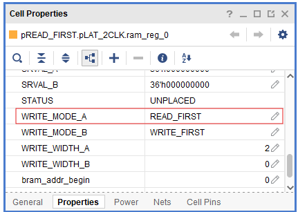
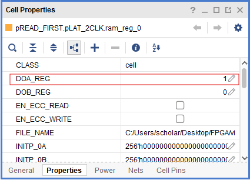
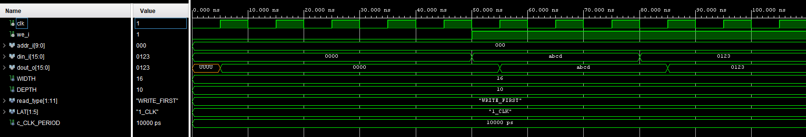
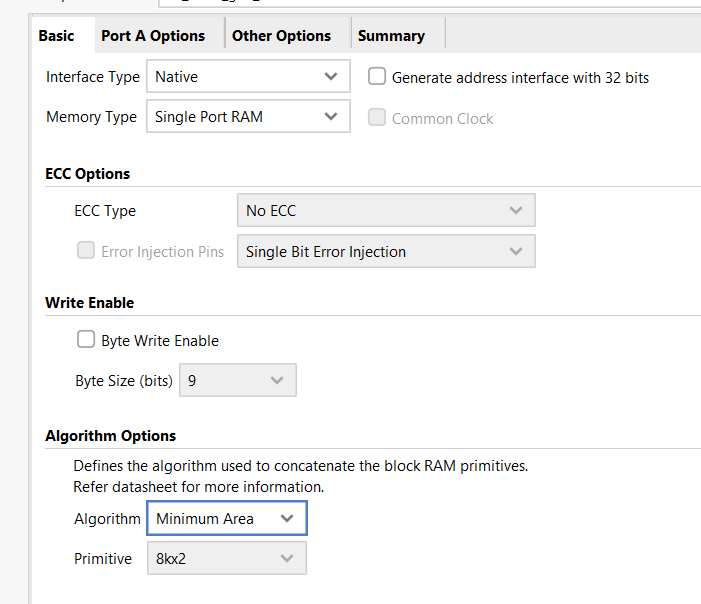
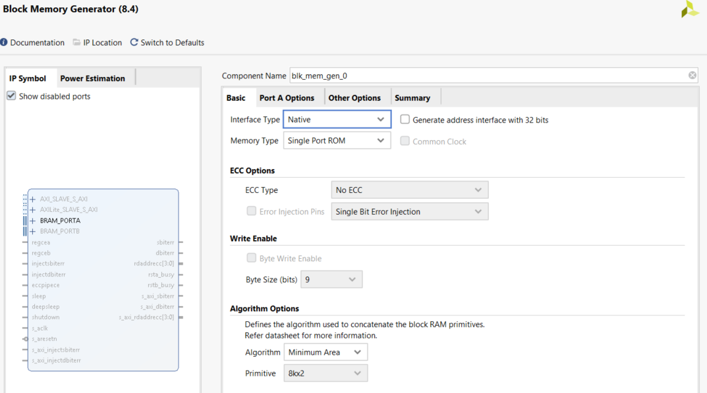
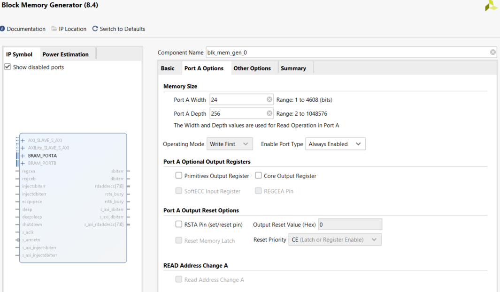
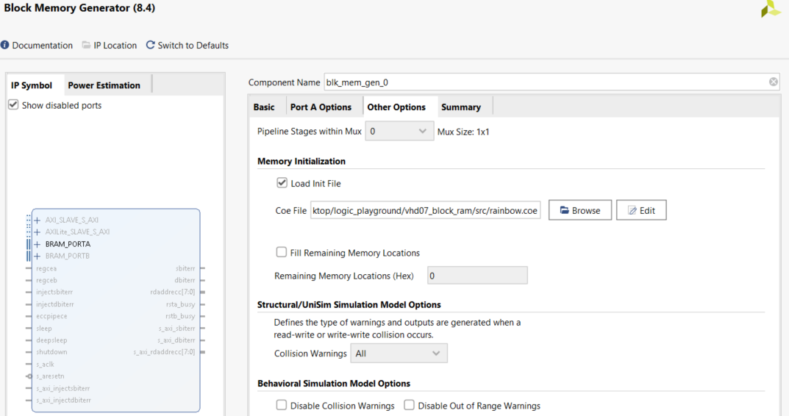

# BRAM Usage — Single-Port Block RAM

This module implements a **single-port synchronous RAM** (Block RAM inference) in VHDL.
It supports **READ_FIRST** and **WRITE_FIRST** modes and configurable read latency (**1-CLK** or **2-CLK**).

---

## Source Files

| File | Description |
|------|-------------|
| `src/spbram.vhd` | Single-port BRAM RTL — parametric read mode and latency |
| `src/tb_spbram.vhd` | Testbench — exercises all four mode/latency combinations |
| `src/uart_bram.vhd` | Top level 1 — receive 3 bytes over UART, store in BRAM, echo back in reverse |
| `src/rgb_bram.vhd` | Top level 2 — rainbow color cycle driven from BRAM LUT |
| `src/rainbow.coe` | BRAM initialization file — 256-entry HSV rainbow color table |

---

## Generics

> Generic string values are **case-sensitive**. Use exactly `"READ_FIRST"` / `"WRITE_FIRST"` and `"1_CLK"` / `"2_CLK"`. Note that `read_type` is intentionally lowercase to match common Xilinx BRAM inference style — all other generics follow the usual UPPERCASE convention.

| Name        | Type    | Default        | Description                                      |
|-------------|---------|----------------|--------------------------------------------------|
| `WIDTH`     | integer | `8`            | Data bus width (bits per word)                   |
| `ADDR_BITS` | integer | `14`           | Address width — depth = 2^ADDR_BITS              |
| `read_type` | string  | `"READ_FIRST"` | Read behavior: `"READ_FIRST"` or `"WRITE_FIRST"` |
| `LAT`       | string  | `"2_CLK"`      | Read latency: `"1_CLK"` or `"2_CLK"`             |

---

## Read Latency

### 1-CLK

`dout_o` updates **one clock** after address changes.

```
clk:   ┌─┐   ┌─┐   ┌─┐
addr:  AAAAA BBBBB CCCCC
dout:  ----- AAA   BBB
```

### 2-CLK

Additional output register — **two clocks** of latency. Helps timing closure at high frequencies.

```
clk:   ┌─┐   ┌─┐   ┌─┐   ┌─┐
addr:  AAAAA BBBBB CCCCC
dout:  ----- ----- AAA   BBB
```

---

## Read/Write Modes

**READ_FIRST** — on a write to the addressed location, `dout_o` shows the **old data** in that cycle. The updated value appears on the next cycle.

**WRITE_FIRST** — on a write, `dout_o` immediately reflects the **new write data** in the same cycle.

### The WRITE_FIRST + 2_CLK caveat

When `LAT="2_CLK"` and `read_type="WRITE_FIRST"` are combined, there is a conflict: the pipeline introduces a 2-cycle delay, but WRITE_FIRST requires the new data to appear immediately. These two requirements cannot both be satisfied at once.

The current implementation resolves this by **bypassing the pipeline on write cycles**:

```vhdl
if we_i = '1' then
    ram(to_integer(unsigned(addr_i))) <= din_i;
    dout_o <= din_i;   -- bypass: drives output directly, skipping the 2-cycle pipeline
end if;
```

The consequence is that on write cycles the effective latency drops to 0, while on read cycles it remains 2. This inconsistency is usually harmless in practice — most designs either write or read in a given cycle, not both.

**If you need strict 2-cycle latency on every cycle without exception**, remove the bypass line:

```vhdl
-- Remove this line to get strict 2-CLK latency on all cycles:
dout_o <= din_i;   -- <-- delete this
```

---

## Inference & Device Notes

The RAM is declared as a VHDL array with a synthesis attribute to guide Vivado toward BRAM:

```vhdl
attribute ram_style : string;
attribute ram_style of ram : signal is "block";
```

Very small depths may still infer **LUTRAM** if the tool decides it is more efficient. To make the code portable across vendors, remove these attribute lines — the synthesis tool will then decide the implementation automatically.

Xilinx BRAM mapping:

- `LAT="1_CLK"` → `DOA_REG = 0` (unregistered output)
- `LAT="2_CLK"` → `DOA_REG = 1` (registered output)

This design targets **single-port** memories only. For true dual-port (simultaneous read + write on separate ports), a different architecture is needed.

**Power-up behavior:** the RTL initializes the array to zeros in simulation. On hardware, power-up contents are undefined unless an init file is provided — not included here.

---

## Minimal Usage

```vhdl
u_bram : entity work.spbram
  generic map (
    WIDTH      => 16,
    ADDR_BITS  => 10,
    read_type  => "WRITE_FIRST",
    LAT        => "1_CLK"
  )
  port map (
    clk    => clk,
    we_i   => we,
    addr_i => addr,
    din_i  => din,
    dout_o => dout
  );
```
---
## Vivado Synthesis Notes

With `read_type = "READ_FIRST"`, Vivado reports the BRAM property accordingly:



With `LAT = "2_CLK"`, Vivado registers the output (`DOA_REG = 1`); with `"1_CLK"` it would be `DOA_REG = 0`:



---

## Testbench

The testbench exercises the four mode/latency combinations and verifies read-back timing. Results:



---

## Top Level 1 — UART + BRAM Echo (`uart_bram.vhd`)

This top level ties together the UART RX, UART TX, and BRAM cores into a complete system. It demonstrates the key challenge of working with registered BRAM outputs — specifically that **you must wait one cycle after changing the address before reading `dout_o`**.

**Behavior:**

1. Receive 3 bytes over UART and store them into BRAM at addresses 0, 1, 2
2. Read them back in **reverse order** (addr 2 → 1 → 0) and echo over UART TX
3. Return to idle, ready for the next 3-byte sequence

```
Receive:  AA → addr 0 | BB → addr 1 | CC → addr 2
Echo TX:  CC           BB             AA
```

LED behavior:

- `"00"` — power-up
- `"01"` — receiving in progress
- `"10"` — echo complete, returned to idle

**The BRAM read timing problem and how it is solved**

After changing `addr_i`, `dout_o` is not valid until the next rising edge (`LAT="1_CLK"`). Reading `dout_o` in the same cycle as the address change captures stale data — this was the root cause of getting `BB BB AA` instead of `CC BB AA`.

The solution is a split state pattern for each read:

```
xSETADDR: change addr_i → transition to xREAD
xREAD:    dout_o is now valid → capture into datain, assert start_tx
```

For STATE5 and STATE6, the `xSETADDR` state also doubles as the `tx_done` wait — two jobs in one state, keeping the FSM compact.

> **Rule of thumb:** always insert at least one cycle between changing a synchronous RAM address and reading the output. The same principle applies to any pipelined memory interface.

---

## Top Level 2 — Rainbow Color Cycle (`rgb_bram.vhd`)

This project uses the **Xilinx Block Memory Generator IP** instead of the inferred BRAM from `spbram.vhd`. The key difference is initialization — the IP loads a `.coe` file at synthesis time, making the BRAM contents read-only and pre-programmed without any runtime writes.






**Architecture:**

```
rainbow_rom (256×24-bit, .coe initialized)
    ↓ douta[23:16] = R
    ↓ douta[15:8]  = G  →  rgb_controller  →  PWM  →  RGB LED
    ↓ douta[7:0]   = B
    ↑
8-bit address counter (steps every 20 ms)
```

**Behavior:** a free-running counter steps through all 256 BRAM addresses, holding each for 20 ms. The full rainbow cycle completes in `256 × 20 ms = 5.12 seconds` and loops seamlessly.

**The `.coe` file** (`src/rainbow.coe`) contains 256 entries of 24-bit hex RGB values representing a full HSV rainbow cycle from red → yellow → green → cyan → blue → magenta → red. Each entry corresponds to one color step held for 20 ms on hardware.

```
memory_initialization_radix=16;
memory_initialization_vector=
FF0000,   -- hue=0°   pure red
FF0500,
...
00FFFF,   -- hue=180° cyan
...
FF0005;   -- hue=359° back to red
```

To use a different color sequence, replace `rainbow.coe` with your own file following the same format and re-generate the IP in Vivado.

**Block Memory Generator IP settings:**

| Setting | Value |
|---------|-------|
| Memory Type | Single Port ROM |
| Port A Width | 24 |
| Port A Depth | 256 |
| Output Registers | None (1-cycle latency) |
| Load Init File | `rainbow.coe` |

**Note on BRAM latency:** `ram_addr` changes on the timer tick and `ram_dout` is valid one cycle later. At 20 ms per step this 1-cycle glitch is completely invisible — no wait states needed here unlike `uart_bram`.

---

## References

1. [VHDL ile FPGA PROGRAMLAMA](https://www.udemy.com/course/vhdl-ile-fpga-programlama-temel-seviye/)
2. [What is a Block RAM in an FPGA?](https://www.youtube.com/watch?v=fqUuvwl4QJA)
3. [Dual-Frequency Sine Wave Generators in Vivado Simulation by Xilinx Block Memory Generator](https://www.youtube.com/watch?v=D8ZnMH-Wv9Y)
4. [BRAM vivado tutorial ECE3610](https://www.youtube.com/watch?v=HPRrzgVfXo8)

---
⬅️ [MAIN PAGE](../README.md) | [UART TX](../vhd07_uart_tx/README.md) | [UART RX](../vhd08_uart_rx/README.md)