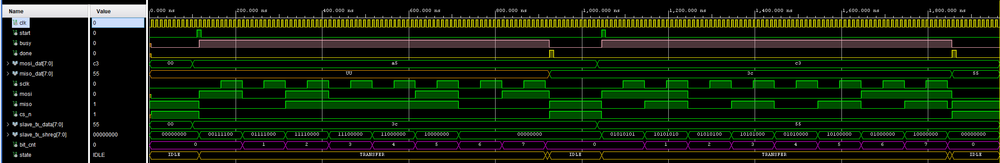

# SPI Master — Mode 0 (VHDL)

A synthesizable, full-duplex **SPI Master** for FPGA boards. Implements **Mode 0** (CPOL=0, CPHA=0): SCK idles low, data is MSB-first. Parameterizable clock frequency, SCK frequency, and transaction width.

---

## Source Files

| File | Description |
|------|-------------|
| `src/spi_mode0.vhd` | Core SPI master FSM — 3-state, timer-based edge detection |
| `src/tb_spi_mode0.vhd` | Testbench — full-duplex slave model, two-transaction sequence with assertions |

---

## Features

* **Timer-based edge detection** — SCK edges are predicted from the timer, not from a registered SCK comparison, eliminating 1–2 cycles of latency
* **Deterministic SCK phase** — timer resets on every transaction start so the first SCK edge is always exactly `HALF_PER` cycles after CS_n asserts, regardless of when `start` is pulsed
* **MOSI pre-loaded** before the first rising SCK edge — data is stable well before the slave samples it
* **Full-duplex** — TX and RX shift registers operate simultaneously within the same state
* One-cycle `done` pulse at the end of each transaction; `busy` held high for the full duration

---

## Mode 0 Timing

```
SCK     ______|‾‾‾‾‾‾|______|‾‾‾‾‾‾|______ ... ______|‾‾‾‾‾‾|______
CS_n  ‾‾‾|___________________________________________________|‾‾‾‾‾
MOSI  ---< MSB >< b6  >< b5  > ...                     < LSB >-----
MISO  ----< MSB >< b6  >< b5  > ...                    < LSB >-----
            ↑            ↑ sample (rising edge)
                  ↓ update (falling edge)
```

* **SCK idle:** low (`'0'`)
* **MOSI:** pre-loaded before first rising SCK edge; updated on every **falling** edge
* **MISO:** sampled on every **rising** SCK edge

---

## Edge Detection Strategy

Instead of registering SCK and comparing old vs. new values (which adds 1–2 clock cycles of latency), edges are detected directly from the half-period timer:

| Condition | Meaning | Action |
|-----------|---------|--------|
| `timer = HALF_PER-1` AND `sclk_r = '0'` | Rising edge occurs **next cycle** | Sample MISO into RX shift register |
| `timer = HALF_PER-1` AND `sclk_r = '1'` | Falling edge occurs **next cycle** | Update MOSI from TX shift register |

Both actions are registered in the same clock cycle as the SCK toggle, so MISO is sampled and MOSI is updated at exactly the edge — minimum possible latency.

The SCK half-period is computed from the generics:

$$
HALF\_PER = \frac{CLK\_FREQ}{SCLK\_FREQ \times 2}
$$

---

## State Machine

`IDLE → TRANSFER → DONE_ST → IDLE`

* **IDLE** — `busy='0'`, `cs_n='1'`, `mosi='0'`. Waits for a one-cycle `start` pulse.
  On assertion: pre-loads MSB onto `mosi`, shifts `tx_shreg`, resets timer and `sclk_r`, asserts `cs_n='0'` and `busy='1'`, transitions to TRANSFER.

* **TRANSFER** — Timer counts 0 → `HALF_PER-1`, then resets and toggles `sclk_r`:
  * **Rising edge** (`sclk_r='0'`): shift `miso` into `rx_shreg` MSB-first.
  * **Falling edge** (`sclk_r='1'`): shift `tx_shreg` and drive next bit onto `mosi`, increment `bit_cnt`.
  * After the last falling edge (`bit_cnt = DATA_W-1`): deassert `sclk_r` and move to DONE_ST.

* **DONE_ST** — single-cycle state: deasserts `cs_n`, clears `mosi`, pulses `done='1'`, latches `rx_shreg` into `miso_dat`, returns to IDLE.

---

## Generics

| Generic | Default | Description |
|---------|---------|-------------|
| `CLK_FREQ` | `12_000_000` | System clock frequency (Hz) |
| `SCLK_FREQ` | `1_000_000` | Desired SCK frequency (Hz) |
| `DATA_W` | `8` | Transaction width (bits) |

---

## Ports

| Port | Direction | Description |
|------|-----------|-------------|
| `clk` | in | System clock |
| `start` | in | One-cycle pulse to begin a transaction |
| `busy` | out | High while a transaction is in progress |
| `done` | out | One-cycle pulse when transaction completes |
| `mosi_dat[DATA_W-1:0]` | in | Data to transmit, latched on `start` |
| `miso_dat[DATA_W-1:0]` | out | Received data, valid on `done` |
| `sclk` | out | SPI clock — active only during TRANSFER |
| `mosi` | out | Master Out Slave In |
| `miso` | in | Master In Slave Out |
| `cs_n` | out | Chip select, active low |

---

## Testbench (`tb_spi_mode0.vhd`)

A simple behavioral SPI slave model drives MISO independently from MOSI to verify the full-duplex paths simultaneously. The slave loads its shift register on the falling edge of CS_n and shifts out MSB-first on each falling SCK edge, so data is stable before the master samples on the rising edge.

**Simulation parameters:** `CLK_FREQ = 100 MHz`, `SCLK_FREQ = 10 MHz`, `DATA_W = 8`

| Transaction | Master sends | Slave sends | Expected `miso_dat` |
|-------------|-------------|-------------|----------------------|
| 1 | `0xA5` | `0x3C` | `0x3C` |
| 2 | `0xC3` | `0x55` | `0x55` |

Results are checked with `assert` statements — a severity-error report fires on mismatch; `SIM DONE` is reported via severity-failure at the end.



---

## References

1. [Mehmet Burak Aykenar – GitHub](https://github.com/mbaykenar/apis_anatolia)
2. [Understanding SPI](https://www.youtube.com/watch?v=0nVNwozXsIc)
3. [SPI Project in FPGA - Ambient Light Sensor](https://www.youtube.com/playlist?list=PLnAoag7Ew-vq5kOyfyNN50xL718AtLoCQ)

---
⬅️  [MAIN PAGE](../README.md)
