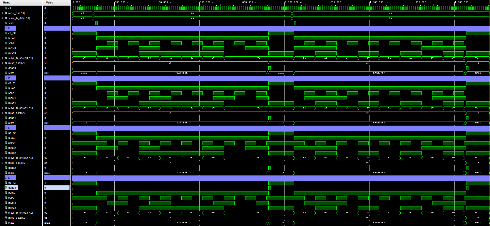

# SPI Master -- All Modes (VHDL)

A synthesizable, full-duplex **SPI Master** supporting all four SPI modes via `CPOL` and `CPHA` generics.
Extends [vhd10](../vhd10_spi_mode0/README.md) (Mode 0 only) to cover the complete Motorola SPI standard.
Parameterizable clock frequency, SCK frequency, and transaction width.

---

## Source Files

| File | Description |
|------|-------------|
| `src/spi_all_modes.vhd`    | SPI master RTL -- 3-state FSM, timer-based edge detection, all 4 modes |
| `src/tb_spi_all_modes.vhd` | Testbench -- four parallel DUTs (one per mode), behavioral slave models, assertions |

---

## SPI Mode Summary

| Mode | CPOL | CPHA | SCK idle | Sample edge | Shift edge |
|------|------|------|----------|-------------|------------|
| 0    | 0    | 0    | LOW      | Rising      | Falling    |
| 1    | 0    | 1    | LOW      | Falling     | Rising     |
| 2    | 1    | 0    | HIGH     | Falling     | Rising     |
| 3    | 1    | 1    | HIGH     | Rising      | Falling    |

Set `CPOL` and `CPHA` generics to select the desired mode.

---

## Features

* **All 4 SPI modes** -- single RTL source, mode selected entirely by generics at elaboration time
* **Timer-based edge detection** -- SCK edges are inferred from the half-period timer, not a registered SCK comparison, eliminating 1-2 cycles of latency
* **Deterministic SCK phase** -- timer resets on every transaction start so the first SCK edge is always exactly `HALF_PER` cycles after CS_n asserts, regardless of when `start` fires
* **CPHA=0:** MSB pre-loaded onto MOSI before CS_n asserts -- data stable before the first SCK edge
* **CPHA=1:** full TX word loaded at start; first bit driven on the first SCK edge
* **Full-duplex** -- TX and RX shift registers operate simultaneously within the same FSM state
* One-cycle `done` pulse at end of each transaction; `busy` held high for the full duration

---

## Edge Detection Strategy

Rather than registering SCK and comparing old vs. new values, edges are detected from the timer and
the current `sclk_r` value. Because `sclk_r <= not sclk_r` is a registered assignment, `sclk_r`
still holds its **old** value in the same cycle the timer expires:

| Condition | Meaning | CPHA=0 action | CPHA=1 action |
|-----------|---------|---------------|---------------|
| `timer = HALF_PER-1` AND `sclk_r = CPOL`    | First edge (SCK leaving idle)       | Sample MISO | Drive MOSI  |
| `timer = HALF_PER-1` AND `sclk_r /= CPOL`   | Second edge (SCK returning to idle) | Drive MOSI  | Sample MISO |

SCK half-period from generics:

$$HALF\_PER = \frac{CLK\_FREQ}{SCLK\_FREQ \times 2}$$

---

## State Machine

`IDLE -> TRANSFER -> DONE_ST -> IDLE`

* **IDLE** -- `busy='0'`, `cs_n='1'`, `mosi='0'`. Waits for a one-cycle `start` pulse.
  On assertion: loads TX data, resets timer and `sclk_r`, asserts `cs_n='0'` and `busy='1'`.
  * CPHA=0: pre-loads MSB onto `mosi`, shifts remaining bits into `tx_shreg`
  * CPHA=1: loads full `mosi_dat` into `tx_shreg`

* **TRANSFER** -- timer counts 0 to `HALF_PER-1`, then resets and toggles `sclk_r`:
  * **First edge** (`sclk_r = CPOL`): CPHA=0 samples MISO; CPHA=1 drives next MOSI bit
  * **Second edge** (`sclk_r /= CPOL`): CPHA=0 drives next MOSI bit; CPHA=1 samples MISO; `bit_cnt` increments
  * After last second edge (`bit_cnt = DATA_W-1`): transitions to DONE_ST

* **DONE_ST** -- single-cycle: deasserts `cs_n`, clears `mosi`, pulses `done='1'`, latches `rx_shreg` into `miso_dat`, returns to IDLE

---

## Generics

| Generic     | Default       | Description |
|-------------|---------------|-------------|
| `CLK_FREQ`  | `12_000_000`  | System clock frequency (Hz) |
| `SCLK_FREQ` | `1_000_000`   | Desired SCK frequency (Hz) |
| `DATA_W`    | `8`           | Transaction width (bits) |
| `CPOL`      | `'0'`         | Clock polarity: `'0'` = idle low, `'1'` = idle high |
| `CPHA`      | `'0'`         | Clock phase: `'0'` = sample-first, `'1'` = shift-first |

---

## Ports

| Port                   | Direction | Description |
|------------------------|-----------|-------------|
| `clk`                  | in  | System clock |
| `start`                | in  | One-cycle pulse to begin a transaction |
| `busy`                 | out | High while a transaction is in progress |
| `done`                 | out | One-cycle pulse when transaction completes |
| `mosi_dat[DATA_W-1:0]` | in  | Data to transmit (MSB first) |
| `miso_dat[DATA_W-1:0]` | out | Received data, valid on `done` |
| `sclk`                 | out | SPI clock -- active only during TRANSFER |
| `mosi`                 | out | Master Out Slave In |
| `miso`                 | in  | Master In Slave Out |
| `cs_n`                 | out | Chip select, active low |

---

## Testbench (`tb_spi_all_modes.vhd`)

Four DUT instances (one per mode) run in parallel driven by a shared `start` pulse and shared `mosi_dat`.
Each DUT has its own behavioral SPI slave model. The slave models follow the same edge convention as the master:

| Mode | Slave loads on  | Slave shifts MISO on |
|------|-----------------|----------------------|
| 0    | CS_n falling    | SCK falling          |
| 1    | CS_n falling    | SCK falling          |
| 2    | CS_n falling    | SCK rising           |
| 3    | CS_n falling    | SCK rising           |

**Simulation parameters:** `CLK_FREQ = 100 MHz`, `SCLK_FREQ = 10 MHz`, `DATA_W = 8`

| Transaction | Master sends | Slave sends | Expected `miso_dat` |
|-------------|-------------|-------------|----------------------|
| 1           | `0xA5`      | `0x3C`      | `0x3C`               |
| 2           | `0xC3`      | `0x55`      | `0x55`               |

Results are checked with `assert` statements after each transaction -- a severity-error report fires
on mismatch. All four modes passed both transactions.

---

## Known Limitations

| Limitation | Impact |
|------------|--------|
| No reset port | Relies on signal initializers for power-on state (fine for Xilinx GSR) |
| `HALF_PER` must be >= 1 | `SCLK_FREQ` must not exceed `CLK_FREQ / 2` |
| No MISO synchronizer | Metastability risk on the MISO input pin in noisy environments |
| MSB-first only | LSB-first devices require external bit reversal |
| Single CS_n | Multi-slave designs need external chip-select decoding |

---

## References

1. [Understanding SPI](https://www.youtube.com/watch?v=0nVNwozXsIc)
2. [Serial Peripheral Interface -- Wikipedia](https://en.wikipedia.org/wiki/Serial_Peripheral_Interface)

---

<= [MAIN PAGE](../README.md)
