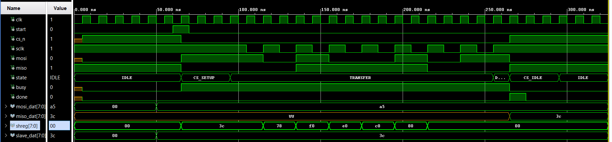

# SPI Master with CS Setup/Idle Timing (VHDL)

A synthesizable, full-duplex **SPI Master** extending [vhd11](../vhd11_spi_all_modes/README.md) (all 4 modes)
with two additional timing generics: **`CS_SETUP_TICKS`** (CS assert → first SCK edge) and
**`CS_IDLE_TICKS`** (CS deassert hold time between frames).
Required by many devices — for example the AD5628 DAC specifies t_CSS and t8 minimums.

---

## Source Files

| File | Description |
|------|-------------|
| [src/spi_cs_timing.vhd](src/spi_cs_timing.vhd) | SPI master RTL — 5-state FSM, all 4 modes, configurable CS setup and idle timing |
| [src/tb_spi_cs_timing.vhd](src/tb_spi_cs_timing.vhd) | Testbench — Mode 2 (CPOL=1, CPHA=0), single transaction, verifies CS timing and RX capture |
| [src/tb_spi_cs_timing_4modes.vhd](src/tb_spi_cs_timing_4modes.vhd) | Regression testbench — all 4 SPI modes in parallel, two transactions each, self-checking assertions |

---

## SPI Mode Summary

| Mode | CPOL | CPHA | SCK idle | Sample edge | Shift edge |
|------|------|------|----------|-------------|------------|
| 0    | 0    | 0    | LOW      | Rising      | Falling    |
| 1    | 0    | 1    | LOW      | Falling     | Rising     |
| 2    | 1    | 0    | HIGH     | Falling     | Rising     |
| 3    | 1    | 1    | HIGH     | Rising      | Falling    |

---

## Features

* **All 4 SPI modes** — single RTL source, mode selected by `CPOL`/`CPHA` generics
* **CS_SETUP_TICKS** — guaranteed setup time from CS_n assert to first SCK edge (t_CSS)
* **CS_IDLE_TICKS** — guaranteed CS_n high time between consecutive frames (t8)
* Both timing generics accept `0` to bypass their states and go straight to TRANSFER/IDLE
* **Timer-based edge detection** — SCK edges inferred from half-period timer, zero extra latency
* **Deterministic SCK phase** — timer resets on every transaction start
* **CPHA=0:** MSB pre-loaded onto MOSI before CS_n asserts
* **CPHA=1:** full TX word loaded at start; first bit driven on first SCK edge
* **Full-duplex** — TX and RX shift registers operate simultaneously
* One-cycle `done` pulse; `busy` held high for full transaction duration

---

## State Machine

```
IDLE ──(start)──► CS_SETUP ──(CS_SETUP_TICKS)──► TRANSFER ──(all bits done)──► DONE_ST
                                                                                    │
IDLE ◄──(CS_IDLE_TICKS)── CS_IDLE ◄────────────────────────────────────────────────┘
```

| State      | Action |
|------------|--------|
| `IDLE`     | `busy='0'`, `cs_n='1'`. On `start`: asserts `cs_n`, loads TX data, resets timer |
| `CS_SETUP` | Holds CS_n low for `CS_SETUP_TICKS` cycles before the first SCK edge |
| `TRANSFER` | Toggles SCK every `HALF_PER` cycles; shifts TX/RX data bit by bit |
| `DONE_ST`  | Single cycle: deasserts `cs_n`, latches received data, pulses `done` |
| `CS_IDLE`  | Holds CS_n high for `CS_IDLE_TICKS` cycles before returning to IDLE |

---

## Generics

| Generic          | Default         | Description |
|------------------|-----------------|-------------|
| `CLK_FREQ`       | `100_000_000`   | System clock frequency (Hz) |
| `SCLK_FREQ`      | `50_000_000`    | Desired SCK frequency (Hz) |
| `DATA_W`         | `32`            | Transaction width (bits) |
| `CPOL`           | `'1'`           | Clock polarity: `'0'` = idle low, `'1'` = idle high |
| `CPHA`           | `'0'`           | Clock phase: `'0'` = sample-first, `'1'` = shift-first |
| `CS_SETUP_TICKS` | `1`             | Sys-clk cycles from CS assert to first SCK edge (t_CSS). `0` = skip CS_SETUP state |
| `CS_IDLE_TICKS`  | `1`             | Sys-clk cycles CS_n must stay high between frames (t8). `0` = skip CS_IDLE state |

---

## Ports

| Port                   | Direction | Description |
|------------------------|-----------|-------------|
| `clk`                  | in  | System clock |
| `start`                | in  | One-cycle pulse to begin a transaction |
| `busy`                 | out | High while a transaction is in progress |
| `done`                 | out | One-cycle pulse when transaction completes |
| `mosi_dat[DATA_W-1:0]` | in  | Data to transmit (MSB first) |
| `miso_dat[DATA_W-1:0]` | out | Received data, valid on `done` |
| `sclk`                 | out | SPI clock — active only during TRANSFER |
| `mosi`                 | out | Master Out Slave In |
| `miso`                 | in  | Master In Slave Out |
| `cs_n`                 | out | Chip select, active low |

---

## RTL — `spi_cs_timing.vhd`

The single architecture `Behavioral` implements the full master.
Key internals:

| Signal / Constant | Purpose |
|-------------------|---------|
| `HALF_PER` | Constant — `CLK_FREQ / (SCLK_FREQ * 2)`. Number of system-clock cycles per SCK half-period. Must be ≥ 1. |
| `state` | Current FSM state (`IDLE / CS_SETUP / TRANSFER / DONE_ST / CS_IDLE`) |
| `timer` | Counts down half-periods in TRANSFER and ticks in CS_SETUP/CS_IDLE |
| `sclk_r` | Registered SCK value. Because the flip-flop assignment `sclk_r <= not sclk_r` is registered, `sclk_r` still holds the **old** value in the same cycle the timer expires. This lets the FSM read `sclk_r = CPOL` (first edge) vs `sclk_r = not CPOL` (second edge) without any extra pipeline stage. |
| `tx_shreg` | Transmit shift register — MSB driven onto MOSI at each shift edge |
| `rx_shreg` | Receive shift register — MISO shifted in at each sample edge; latched to `miso_dat` in DONE_ST |
| `bit_cnt`  | Counts completed bits (0 to DATA_W-1); transition to DONE_ST when `bit_cnt = DATA_W-1` |

**CPHA=0 pre-load:** When `start` fires, the MSB of `mosi_dat` is driven directly onto `mosi` and the remaining bits are packed into `tx_shreg`. This guarantees MOSI is valid well before the first SCK edge, satisfying setup-time requirements.

**CPHA=1 load:** The full `mosi_dat` word goes into `tx_shreg` at start. The first bit is only driven onto `mosi` on the first SCK edge (shift-first convention).

**SCK gating:** The concurrent assignment `sclk <= sclk_r when state = TRANSFER else CPOL` keeps SCK at its idle level in all non-TRANSFER states, so the slave never sees spurious edges.

---

## Testbench 1 — `tb_spi_cs_timing.vhd`

Single DUT in **Mode 2** (CPOL=1, CPHA=0) with `CS_SETUP_TICKS=3`, `CS_IDLE_TICKS=3`.

| Parameter    | Value |
|--------------|-------|
| CLK_FREQ     | 100 MHz (10 ns period) |
| SCLK_FREQ    | 50 MHz → HALF_PER = 1 |
| DATA_W       | 8 bits |
| CS_SETUP     | 3 sys-clk cycles |
| CS_IDLE      | 3 sys-clk cycles |
| Master sends | `0xA5` |
| Slave sends  | `0x3C` |

**Behavioral slave model:** loads `slave_dat` into its shift register on the falling edge of `cs_n`, then shifts MSB out on each rising SCK edge (matching Mode 2 CPOL=1 idle). MISO floats to `'1'` when `cs_n` is deasserted.

**Stimulus:** after 5 clock cycles of setup, `mosi_dat = 0xA5` and `slave_dat = 0x3C` are set, then a one-cycle `start` pulse launches the transaction. The process waits for `done` to pulse, then terminates with an assertion-failure report (`"SIM DONE"`) — the standard clean-stop idiom in GHDL/Vivado sim.

**What to check:** `miso_dat` captures `0x3C` on `done`. The internal `shreg` signal shows the slave bit-by-bit shift: `3C → 78 → F0 → E0 → C0 → 80 → 00`.

### Waveform — CS Setup/Idle timing



Reading left to right across the waveform:

1. **IDLE (~0–50 ns):** `cs_n=1`, `sclk=1` (CPOL=1 idle), `busy=0`. `mosi_dat` shows `0x00` before stimulus loads it. `state` label reads **IDLE**.

2. **`start` pulse (~50 ns):** `start` goes high for one clock cycle. `cs_n` immediately falls to `'0'`, `busy` asserts, MSB of `0xA5` (`'1'`) pre-loaded onto MOSI. State transitions to **CS_SETUP**.

3. **CS_SETUP (~50–80 ns):** `cs_n` stays low, `sclk` stays at idle (`'1'`), no SCK activity. This is the 3-cycle t_CSS hold window. `mosi_dat` now shows `a5`.

4. **TRANSFER (~80–260 ns):** `sclk` begins toggling at 50 MHz. `mosi` carries the 8 bits of `0xA5` MSB-first. `miso` drives back `0x3C` from the slave. The `shreg` values stepping through `3c → 78 → f0 → e0 → c0 → 80 → 00` show the slave register shifting left after each SCK rising edge. State label reads **TRANSFER**.

5. **DONE_ST (~260 ns, one cycle, labelled "D..."):** `cs_n` deasserts, `done` pulses, `miso_dat` latches to `3c`. This is a single-cycle state.

6. **CS_IDLE (~260–290 ns):** `cs_n=1`, `sclk=1`, `busy=0`. The 3-cycle t8 hold before the bus is free. State label reads **CS_IDLE**.

7. **IDLE again (~290 ns onward):** `done` has already gone low, all signals returned to idle. State reads **IDLE**.

---

## Testbench 2 — `tb_spi_cs_timing_4modes.vhd`

Regression testbench instantiating **four DUT instances in parallel**, one per SPI mode. Both `CS_SETUP_TICKS` and `CS_IDLE_TICKS` are set to `0` on all instances, bypassing the new states so this test checks that the CS timing additions did not break core SPI behavior (equivalent to vhd11).

| Parameter    | Value |
|--------------|-------|
| CLK_FREQ     | 100 MHz |
| SCLK_FREQ    | 25 MHz → HALF_PER = 2 |
| DATA_W       | 8 bits |
| CS_SETUP     | 0 (bypassed) |
| CS_IDLE      | 0 (bypassed) |

**Slave models per mode:**

| Instance | Mode | CPOL | CPHA | Slave shifts MISO on |
|----------|------|------|------|----------------------|
| `inst_MODE0` | 0 | 0 | 0 | Falling SCK edge |
| `inst_MODE1` | 1 | 0 | 1 | Falling SCK edge |
| `inst_MODE2` | 2 | 1 | 0 | Rising SCK edge |
| `inst_MODE3` | 3 | 1 | 1 | Rising SCK edge |

All four slaves share `slave_tx_data` (loaded on `cs_n` falling edge) but drive separate MISO lines.

**Test sequence:**

| Transaction | Master sends | Slave sends | Expected `miso_dat` |
|-------------|-------------|------------|---------------------|
| 1           | `0xA5`      | `0x3C`     | `0x3C` on all 4 modes |
| 2           | `0xC3`      | `0x55`     | `0x55` on all 4 modes |

Self-checking `assert` statements verify every `miso_dat` after each transaction. If all pass, the sim ends with `"SIM PASS -- all 4 modes, both transactions complete"` (severity failure = clean stop).

### Waveform — All 4 Modes


The waveform is divided into four horizontal bands, one per DUT instance. Reading across all bands:

- **Transaction 1 (~left half):** all four `cs_n` lines drop together on the shared `start` pulse. Each `sclk` idles at its CPOL level between the edges. Mode 0/1 (CPOL=0) show SCK idle LOW; Mode 2/3 (CPOL=1) show SCK idle HIGH. All four `miso_dat` buses settle to `0x3C` after their respective `done` pulses.

- **Gap between transactions:** a 10-cycle wait is inserted in the stimulus. `cs_n` stays high on all four instances.

- **Transaction 2 (~right half):** same structure. All four `miso_dat` buses settle to `0x55`.

- **SCK phase difference between CPHA=0 and CPHA=1:** within each CPOL group, the CPHA=0 instance drives MOSI one half-period earlier (pre-loaded before the first SCK edge), while the CPHA=1 instance drives it on the first edge itself. This is visible as a half-period MOSI offset between mode pairs (0 vs 1, and 2 vs 3).

---

## Known Limitations

| Limitation | Impact |
|------------|--------|
| No reset port | Relies on signal initializers for power-on state (fine for Xilinx GSR) |
| `HALF_PER` must be ≥ 1 | `SCLK_FREQ` must not exceed `CLK_FREQ / 2` |
| No MISO synchronizer | Metastability risk on MISO in noisy environments |
| MSB-first only | LSB-first devices require external bit reversal |
| Single CS_n | Multi-slave designs need external chip-select decoding |

---

## References

1. [Understanding SPI](https://www.youtube.com/watch?v=0nVNwozXsIc)
2. [Serial Peripheral Interface — Wikipedia](https://en.wikipedia.org/wiki/Serial_Peripheral_Interface)

---

⬅️ [MAIN PAGE](../README.md) | ⬅️ [SPI All Modes](../vhd11_spi_all_modes/README.md) | [PmodDA4 Driver](../d01_pmodda4/README.md) | [Sawtooth DAC](../p00_sawtooth_dac/README.md)
