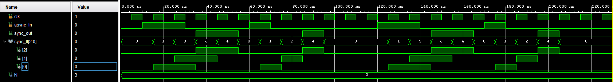

# CDC Synchronizer + Synchronized UART Receiver

A generic multi-flip-flop **synchronizer** for crossing an asynchronous single-bit signal into a clock domain, plus a **UART RX** core wrapped behind it (`uart_rx_synched`) as a worked example of CDC applied to a real asynchronous input.

---

## Source Files

| File | Description |
|------|-------------|
| `src/synchronizer.vhd` | Generic `N`-stage synchronizer (default N=3), `ASYNC_REG` attribute set |
| `src/uart_rx.vhd` | UART RX core — mid-bit sampling, 4-state FSM |
| `src/uart_rx_synched.vhd` | Top level — instantiates `synchronizer` in front of `uart_rx` |
| `src/tb_uart_rx_synched.vhd` | Testbench — drives a UART frame into `rx_in`, observes `data_out`/`read_done` |

---

## Why Synchronize `rx_in`?

`rx_in` comes from an external UART line — it changes asynchronously with respect to `clk` and can violate setup/hold on the first flip-flop it hits, risking metastability. Passing it through `N` flip-flops first (with `ASYNC_REG` marking them so placement/timing tools treat them correctly) gives the signal time to resolve before it reaches the FSM logic in `uart_rx`.

```
rx_in ──► [FF]─►[FF]─►[FF] ──► sync_out ──► uart_rx.rx_in
           N-stage synchronizer
```

`data_o` is tapped combinationally off the last flip-flop (`sync_ff'left`), so total latency is exactly **N** cycles.



---

## Ports (`uart_rx_synched`)

| Port | Direction | Description |
|------|-----------|-------------|
| `clk` | in | System clock |
| `rx_in` | in | Asynchronous serial input, idle high |
| `data_out[7:0]` | out | Received byte, stable while `read_done = '1'` |
| `read_done` | out | One-cycle pulse at end of valid frame |

Generics: `CLK_FREQ`, `BAUD_RATE` (passed through to `uart_rx`), `N` (synchronizer depth, passed to `synchronizer`).

---

## Relation to [vhd08_uart_rx](../vhd08_uart_rx/README.md)

`src/uart_rx.vhd` here is the same core as `vhd08_uart_rx/src/uart_rx.vhd` (differs only in formatting). Neither version re-checks `rx_in` at the T/2 point before committing to the start bit, nor validates the stop bit before asserting `read_done` — both are lean, single-sample cores with no glitch rejection or framing-error detection. Worth adding those checks to both if used on a noisy or unverified line.

---

## Testbench (`tb_uart_rx_synched.vhd`)

Drives a clean UART frame (`0xAB` at 115200 Bd / 100 MHz) into `rx_in` and instantiates `uart_rx_synched` as the DUT, exercising the synchronizer and RX core together end-to-end.

---

⬅️ [MAIN PAGE](../README.md) | ⬅️ [SPI Master — With CS/Idle Timing](../vhd12_cs_timing/README.md)
