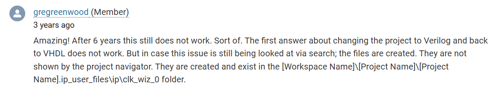

# Vivado Troubleshooting Log

Quick-reference for issues encountered during Vivado development.

---

## Index

| # | Issue | Status |
|---|-------|--------|
| [001](#issue-001) | Clock Wizard not generating VHDL instantiation template | Resolved |
| [002](#issue-002) | Changing the code editor | Resolved |

---

## Issue 001 — Clock Wizard not generating VHDL instantiation template

**Symptom:** `.vho` file not visible in Vivado's Sources panel after generating Clock Wizard IP.

**Root cause:** Vivado generates the `.vho` file on disk but does not always display it in the GUI.

**Fix:**
1. Check the IP output directory directly — the `.vho` file is present on disk even when not shown in Vivado.
2. Alternatively, change the project target language to Verilog then switch back to VHDL to force regeneration.

**Reference:** [AMD Support Thread](https://adaptivesupport.amd.com/s/question/0D52E00006iI5CaSAK/vivado-not-generating-vhdl-instantiation-templates-for-clock-wizard?language=en_US)



---

## Issue 002 — Changing the code editor

**Symptom:** Vivado's built-in editor is inconvenient; you want to open source files in VS Code instead.

**Fix:**

Navigate to **Tools → Settings → Text Editor → Custom Editor**, click `...`, and enter the following for VS Code:

```
C:/Users/<username>/AppData/Local/Programs/Microsoft VS Code/Code.exe [file name] -g[line number]
```

Replace `<username>` with your Windows username. The `[file name]` and `-g[line number]` tokens are Vivado placeholders — enter them literally.

---
⬅️ [MAIN PAGE](../README.md) | ➡️ [Programming FPGA with QSPI Flash](../viv01_programming_fpga/README.md)
